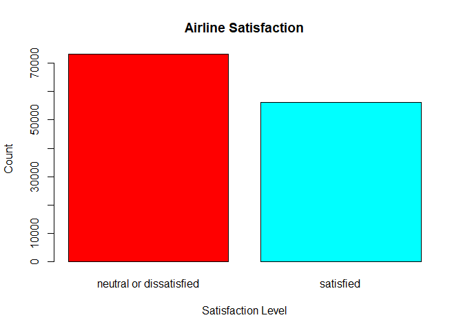
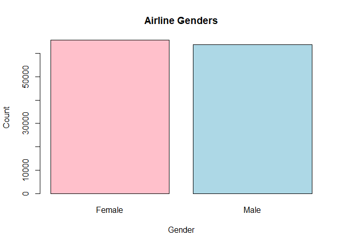
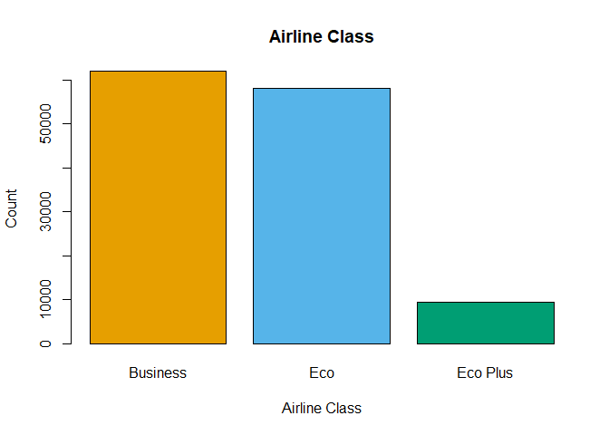
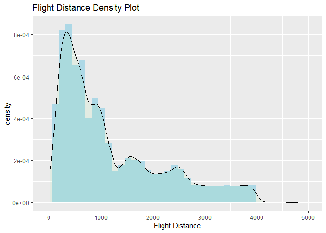
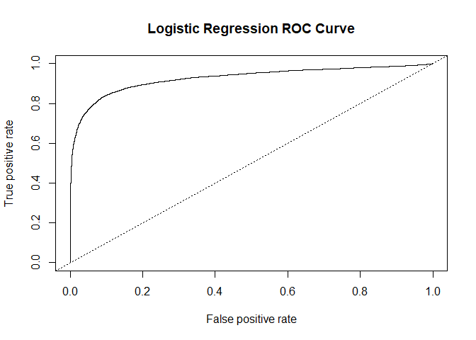
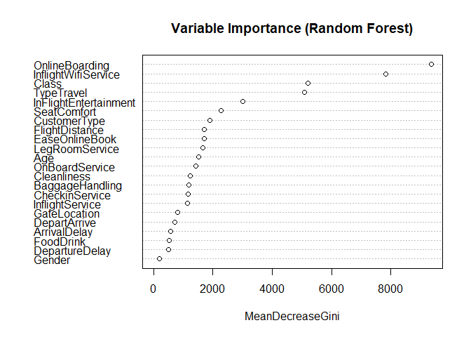

Airline Passenger Satisfaction
================

# Introduction

### Data Set Information:

This data set is a survey conducted in 2015 on Airline Passengers
Satisfaction level where it contains other attributes such as Type of
Travel, Gender, Airplane Amenities, Flight Distance and more. This data
set was uploaded on Kaggle which can be found
[here.](https://www.kaggle.com/datasets/teejmahal20/airline-passenger-satisfaction)

### Goal:

To Answer 3 Research Questions:  
1. What are the statistically significant predictors for each of the
machine learning models?  
2. What machine learning algorithm produced the highest accuracy in
determining airline satisfaction level?  
3. How does each model handle imbalanced classes in the response
variable?  

``` r
# load the data
df = read_excel('~/Stat473/satisfaction_2015.xlsx')
glimpse(df)
```

    ## Rows: 129,880
    ## Columns: 24
    ## $ id                                  <dbl> 117135, 72091, 29663, 81849, 83693…
    ## $ satisfaction_v2                     <chr> "satisfied", "satisfied", "satisfi…
    ## $ Gender                              <chr> "Male", "Male", "Male", "Female", …
    ## $ `Customer Type`                     <chr> "disloyal Customer", "disloyal Cus…
    ## $ Age                                 <dbl> 56, 49, 55, 36, 55, 15, 51, 26, 37…
    ## $ `Type of Travel`                    <chr> "Personal Travel", "Personal Trave…
    ## $ Class                               <chr> "Eco", "Eco", "Eco", "Eco", "Eco",…
    ## $ `Flight Distance`                   <dbl> 369, 2486, 1448, 1501, 577, 2704, …
    ## $ `Inflight wifi service`             <dbl> 0, 0, 0, 0, 0, 1, 1, 1, 1, 1, 1, 1…
    ## $ `Departure/Arrival time convenient` <dbl> 2, 2, 3, 4, 5, 0, 0, 1, 1, 1, 2, 2…
    ## $ `Ease of Online booking`            <dbl> 0, 1, 0, 0, 0, 1, 1, 1, 1, 1, 1, 1…
    ## $ `Gate location`                     <dbl> 4, 4, 4, 3, 3, 4, 4, 3, 4, 4, 3, 3…
    ## $ `Food and drink`                    <dbl> 3, 2, 3, 4, 3, 1, 1, 2, 2, 4, 3, 2…
    ## $ `Online boarding`                   <dbl> 0, 1, 0, 0, 5, 1, 1, 1, 1, 1, 1, 1…
    ## $ `Seat comfort`                      <dbl> 3, 3, 3, 4, 3, 1, 1, 2, 2, 4, 3, 2…
    ## $ `Inflight entertainment`            <dbl> 3, 2, 3, 4, 3, 1, 1, 2, 2, 4, 3, 2…
    ## $ `On-board service`                  <dbl> 1, 1, 3, 5, 3, 5, 5, 2, 2, 3, 2, 4…
    ## $ `Leg room service`                  <dbl> 5, 1, 5, 4, 4, 3, 3, 5, 5, 4, 1, 2…
    ## $ `Baggage handling`                  <dbl> 3, 4, 3, 5, 5, 5, 5, 2, 3, 4, 4, 3…
    ## $ `Checkin service`                   <dbl> 3, 4, 2, 5, 3, 5, 4, 1, 3, 4, 2, 4…
    ## $ `Inflight service`                  <dbl> 4, 3, 3, 5, 4, 5, 4, 3, 3, 3, 4, 4…
    ## $ Cleanliness                         <dbl> 3, 2, 3, 4, 3, 1, 1, 2, 2, 4, 3, 2…
    ## $ `Departure Delay in Minutes`        <dbl> 0, 0, 0, 0, 0, 0, 20, 0, 5, 0, 18,…
    ## $ `Arrival Delay in Minutes`          <dbl> 0, 0, 0, 0, 0, 0, 22, 0, 4, 13, 4,…

# Exploratory Data Analysis

``` r
# Data Dimensions
dim(df)
```

    ## [1] 129880     24

We are given 24 features and 129,880 total observations for our dataset.

``` r
# Check for missing values
colSums(is.na(df))
```

    ##                                id                   satisfaction_v2 
    ##                                 0                                 0 
    ##                            Gender                     Customer Type 
    ##                                 0                                 0 
    ##                               Age                    Type of Travel 
    ##                                 0                                 0 
    ##                             Class                   Flight Distance 
    ##                                 0                                 0 
    ##             Inflight wifi service Departure/Arrival time convenient 
    ##                                 0                                 0 
    ##            Ease of Online booking                     Gate location 
    ##                                 0                                 0 
    ##                    Food and drink                   Online boarding 
    ##                                 0                                 0 
    ##                      Seat comfort            Inflight entertainment 
    ##                                 0                                 0 
    ##                  On-board service                  Leg room service 
    ##                                 0                                 0 
    ##                  Baggage handling                   Checkin service 
    ##                                 0                                 0 
    ##                  Inflight service                       Cleanliness 
    ##                                 0                                 0 
    ##        Departure Delay in Minutes          Arrival Delay in Minutes 
    ##                                 0                               393

  
As we can see our Arrival Delay in Minutes attribute has a total of 393
missing values. Since we are given a relatively large data set we will
drop the observations with missing values.  

``` r
# drop missing values
df = df |> drop_na()
# check for any missing values
sum(is.na(df))
```

    ## [1] 0

``` r
# check for duplicates
sum(duplicated(df))
```

    ## [1] 0

``` r
# statistical summary using skim function from skimr
skim(df)
```

|                                                  |        |
|:-------------------------------------------------|:-------|
| Name                                             | df     |
| Number of rows                                   | 129487 |
| Number of columns                                | 24     |
| \_\_\_\_\_\_\_\_\_\_\_\_\_\_\_\_\_\_\_\_\_\_\_   |        |
| Column type frequency:                           |        |
| character                                        | 5      |
| numeric                                          | 19     |
| \_\_\_\_\_\_\_\_\_\_\_\_\_\_\_\_\_\_\_\_\_\_\_\_ |        |
| Group variables                                  | None   |

Data summary

**Variable type: character**

| skim_variable   | n_missing | complete_rate | min | max | empty | n_unique | whitespace |
|:----------------|----------:|--------------:|----:|----:|------:|---------:|-----------:|
| satisfaction_v2 |         0 |             1 |   9 |  23 |     0 |        2 |          0 |
| Gender          |         0 |             1 |   4 |   6 |     0 |        2 |          0 |
| Customer Type   |         0 |             1 |  14 |  17 |     0 |        2 |          0 |
| Type of Travel  |         0 |             1 |  15 |  15 |     0 |        2 |          0 |
| Class           |         0 |             1 |   3 |   8 |     0 |        3 |          0 |

**Variable type: numeric**

| skim_variable                     | n_missing | complete_rate |     mean |       sd |  p0 |     p25 |   p50 |     p75 |   p100 | hist  |
|:----------------------------------|----------:|--------------:|---------:|---------:|----:|--------:|------:|--------:|-------:|:------|
| id                                |         0 |             1 | 64958.34 | 37489.78 |   1 | 32494.5 | 64972 | 97415.5 | 129880 | ▇▇▇▇▇ |
| Age                               |         0 |             1 |    39.43 |    15.12 |   7 |    27.0 |    40 |    51.0 |     85 | ▃▇▇▅▁ |
| Flight Distance                   |         0 |             1 |  1190.21 |   997.56 |  31 |   414.0 |   844 |  1744.0 |   4983 | ▇▃▂▁▁ |
| Inflight wifi service             |         0 |             1 |     2.73 |     1.33 |   0 |     2.0 |     3 |     4.0 |      5 | ▆▇▇▆▃ |
| Departure/Arrival time convenient |         0 |             1 |     3.06 |     1.53 |   0 |     2.0 |     3 |     4.0 |      5 | ▆▆▆▇▇ |
| Ease of Online booking            |         0 |             1 |     2.76 |     1.40 |   0 |     2.0 |     3 |     4.0 |      5 | ▇▇▇▆▅ |
| Gate location                     |         0 |             1 |     2.98 |     1.28 |   0 |     2.0 |     3 |     4.0 |      5 | ▅▆▇▇▃ |
| Food and drink                    |         0 |             1 |     3.20 |     1.33 |   0 |     2.0 |     3 |     4.0 |      5 | ▅▇▇▇▇ |
| Online boarding                   |         0 |             1 |     3.25 |     1.35 |   0 |     2.0 |     3 |     4.0 |      5 | ▃▅▆▇▆ |
| Seat comfort                      |         0 |             1 |     3.44 |     1.32 |   0 |     2.0 |     4 |     5.0 |      5 | ▃▃▅▇▇ |
| Inflight entertainment            |         0 |             1 |     3.36 |     1.33 |   0 |     2.0 |     4 |     4.0 |      5 | ▃▅▅▇▇ |
| On-board service                  |         0 |             1 |     3.38 |     1.29 |   0 |     2.0 |     4 |     4.0 |      5 | ▃▃▆▇▆ |
| Leg room service                  |         0 |             1 |     3.35 |     1.32 |   0 |     2.0 |     4 |     4.0 |      5 | ▃▆▆▇▇ |
| Baggage handling                  |         0 |             1 |     3.63 |     1.18 |   1 |     3.0 |     4 |     5.0 |      5 | ▂▂▅▇▆ |
| Checkin service                   |         0 |             1 |     3.31 |     1.27 |   0 |     3.0 |     3 |     4.0 |      5 | ▃▃▇▇▆ |
| Inflight service                  |         0 |             1 |     3.64 |     1.18 |   0 |     3.0 |     4 |     5.0 |      5 | ▂▂▅▇▆ |
| Cleanliness                       |         0 |             1 |     3.29 |     1.31 |   0 |     2.0 |     3 |     4.0 |      5 | ▃▅▇▇▇ |
| Departure Delay in Minutes        |         0 |             1 |    14.64 |    37.93 |   0 |     0.0 |     0 |    12.0 |   1592 | ▇▁▁▁▁ |
| Arrival Delay in Minutes          |         0 |             1 |    15.09 |    38.47 |   0 |     0.0 |     0 |    13.0 |   1584 | ▇▁▁▁▁ |

``` r
# convert categorical variables into factors
# drop the ID column
factor_names = c('satisfaction_v2', 'Gender', 'Customer Type', 'Type of Travel', 'Class' )
df = df |> dplyr::select(-1) |> 
  mutate_at(factor_names, as.factor)
```

``` r
# renaming the columns to make it easier to work with

colnames(df) <- c('Satisfaction','Gender','CustomerType','Age', "TypeTravel", "Class", "FlightDistance", "InflightWifiService", "DepartArrive", "EaseOnlineBook", "GateLocation", "FoodDrink", "OnlineBoarding", "SeatComfort", "InFlightEntertainment", "OnBoardService", "LegRoomService", "BaggageHandling","CheckinService", "InflightService", "Cleanliness", "DepartureDelay", "ArrivalDelay" )
```

``` r
# check column data types
str(df)
```

    ## tibble [129,487 × 23] (S3: tbl_df/tbl/data.frame)
    ##  $ Satisfaction         : Factor w/ 2 levels "neutral or dissatisfied",..: 2 2 2 2 2 1 1 1 1 1 ...
    ##  $ Gender               : Factor w/ 2 levels "Female","Male": 2 2 2 1 2 1 2 1 1 1 ...
    ##  $ CustomerType         : Factor w/ 2 levels "disloyal Customer",..: 1 1 1 1 1 1 1 1 1 1 ...
    ##  $ Age                  : num [1:129487] 56 49 55 36 55 15 51 26 37 65 ...
    ##  $ TypeTravel           : Factor w/ 2 levels "Business travel",..: 2 2 2 2 2 2 2 2 2 2 ...
    ##  $ Class                : Factor w/ 3 levels "Business","Eco",..: 2 2 2 2 2 2 2 2 2 2 ...
    ##  $ FlightDistance       : num [1:129487] 369 2486 1448 1501 577 ...
    ##  $ InflightWifiService  : num [1:129487] 0 0 0 0 0 1 1 1 1 1 ...
    ##  $ DepartArrive         : num [1:129487] 2 2 3 4 5 0 0 1 1 1 ...
    ##  $ EaseOnlineBook       : num [1:129487] 0 1 0 0 0 1 1 1 1 1 ...
    ##  $ GateLocation         : num [1:129487] 4 4 4 3 3 4 4 3 4 4 ...
    ##  $ FoodDrink            : num [1:129487] 3 2 3 4 3 1 1 2 2 4 ...
    ##  $ OnlineBoarding       : num [1:129487] 0 1 0 0 5 1 1 1 1 1 ...
    ##  $ SeatComfort          : num [1:129487] 3 3 3 4 3 1 1 2 2 4 ...
    ##  $ InFlightEntertainment: num [1:129487] 3 2 3 4 3 1 1 2 2 4 ...
    ##  $ OnBoardService       : num [1:129487] 1 1 3 5 3 5 5 2 2 3 ...
    ##  $ LegRoomService       : num [1:129487] 5 1 5 4 4 3 3 5 5 4 ...
    ##  $ BaggageHandling      : num [1:129487] 3 4 3 5 5 5 5 2 3 4 ...
    ##  $ CheckinService       : num [1:129487] 3 4 2 5 3 5 4 1 3 4 ...
    ##  $ InflightService      : num [1:129487] 4 3 3 5 4 5 4 3 3 3 ...
    ##  $ Cleanliness          : num [1:129487] 3 2 3 4 3 1 1 2 2 4 ...
    ##  $ DepartureDelay       : num [1:129487] 0 0 0 0 0 0 20 0 5 0 ...
    ##  $ ArrivalDelay         : num [1:129487] 0 0 0 0 0 0 22 0 4 13 ...

# Data Visualizations

``` r
# correlation matrix plot

# extract numeric columns only
numeric_cols <- sapply(df, is.numeric)
df_numeric <- df[, numeric_cols]

corr_matrix <- cor(df_numeric)
col <- colorRampPalette(c("#BB4444", "#EE9988", "#FFFFFF", "#77AADD", "#4477AA"))
corrplot(corr_matrix, method = 'color', tl.cex = 0.5, title = "Correlation Matrix",
         mar=c(0,0,1,0))
```

<!-- -->  
From the Correlation matrix above we can see that Seat Comfort is high
correlated with food/drinks, in flight entertainment, and cleanliness.
We can also see On-board service is highly correlated with leg room
service, baggage handling, in flight service, and in flight
entertainment.  

``` r
# bar chart on satisfaction
plot(df[,'Satisfaction'], main = 'Airline Satisfaction', 
     ylab = 'Count', xlab = 'Satisfaction Level', col = rainbow(2))
```

<!-- -->  
Satisfaction level is our response variable where we can clearly see it
is a binary classification problem. Satisfaction level has 2 classes
either satisfied or neutral/dissatisfied. From the bar chart above we
can see that the classes are imbalanced. However, the imbalance is not
too wide but we still have too consider that this may cause issues when
fitting our models since they can learn a bit more on
neutral/dissatisfied than the satisfied passengers.  

``` r
# bar chart on Gender
plot(df[,'Gender'], main = 'Airline Genders', 
     ylab = 'Count', xlab = 'Gender', col = c('pink','lightblue'))
```

<!-- -->

``` r
# bar chart on Airline Class
plot(df[,'Class'], main = 'Airline Class', 
     ylab = 'Count', xlab = 'Airline Class',  col = c("#E69F00", "#56B4E9", "#009E73"))
```

<!-- -->  
Here we can see from the Gender bar chart that we have an almost even
distribution on Females and Males in our data set with a slightly bit
more Females. From the Airline Class bar chart we can see that a
majority of passengers in our data were buying Business and Economic
fares over the Economic Plus fares.  

``` r
# bar chart on Airline Type of Travel
plot(df[,'TypeTravel'], main = 'Airline Travel Type', 
     ylab = 'Count', xlab = 'Travel Type', col = c("yellow", "#009E73"))
```

<!-- -->

``` r
# bar chart on Airline Customer Type
plot(df[,'CustomerType'], main = 'Airline Customer Type', 
     ylab = 'Count', xlab = 'Customer Type', col = c("#56B4E9", "#009E73"))
```

<!-- -->  
Here we can see that a majority of the passengers collect in our data
set were primarily traveling for business purposes rather than personal
situations. Note this may include bias since majority of the passengers
are in this data are traveling for business. Also we can see that a
majority of the passengers in the data are loyal customers and we have a
few disloyal or new customers.  

``` r
# Age histogram separated by Gender
ggplot(df, aes(x = Age, color = Gender, fill = Gender)) + 
  geom_histogram(bins = 30) + 
  labs(title = "Age Histogram Separated by Gender", x = "Age", y = "Count")
```

<!-- -->  
From the Age histogram above we can see that a majority of the
passengers Age in our data range between 25 to 60 years old. Now if we
separate the age histogram by gender we can see that we have more
Females in all ranges of ages than Males.  

``` r
ggplot(df, aes(x = FlightDistance)) +                         
  geom_histogram(aes(y = after_stat(density)), bins = 40, fill = "lightblue") +
  geom_density(alpha = 0.1, fill = "lightgreen") +
  labs(title="Flight Distance Density Plot",x="Flight Distance")
```

<!-- -->

  
Here we can see the majority of Flight Distances were no more than 1000
kilometers.  

# Modeling

``` r
# split the data
# split train and test sets to a 80/20 split
n = nrow(df)
prop = .80
set.seed(1)
train_id = sample(1:n, size = round(n*prop), replace = FALSE)
test_id = (1:n)[-which(1:n %in% train_id)]
train_set = df[train_id, ]
test_set = df[test_id, ]
```

## Logistic Regression

``` r
# Fitting a Logistic Regression Model with all predictors
log.fit = glm(Satisfaction ~., data = train_set, family = 'binomial')
summary(log.fit)
```

    ## 
    ## Call:
    ## glm(formula = Satisfaction ~ ., family = "binomial", data = train_set)
    ## 
    ## Deviance Residuals: 
    ##     Min       1Q   Median       3Q      Max  
    ## -2.8774  -0.4932  -0.1768   0.3885   4.0243  
    ## 
    ## Coefficients:
    ##                              Estimate Std. Error z value Pr(>|z|)    
    ## (Intercept)                -7.835e+00  7.864e-02 -99.633  < 2e-16 ***
    ## GenderMale                  6.947e-02  1.945e-02   3.573 0.000353 ***
    ## CustomerTypeLoyal Customer  2.041e+00  2.978e-02  68.541  < 2e-16 ***
    ## Age                        -8.856e-03  7.114e-04 -12.450  < 2e-16 ***
    ## TypeTravelPersonal Travel  -2.737e+00  3.150e-02 -86.905  < 2e-16 ***
    ## ClassEco                   -7.135e-01  2.556e-02 -27.920  < 2e-16 ***
    ## ClassEco Plus              -8.388e-01  4.162e-02 -20.155  < 2e-16 ***
    ## FlightDistance             -1.920e-05  1.129e-05  -1.702 0.088821 .  
    ## InflightWifiService         3.971e-01  1.144e-02  34.697  < 2e-16 ***
    ## DepartArrive               -1.362e-01  8.191e-03 -16.623  < 2e-16 ***
    ## EaseOnlineBook             -1.557e-01  1.130e-02 -13.774  < 2e-16 ***
    ## GateLocation                3.703e-02  9.148e-03   4.048 5.17e-05 ***
    ## FoodDrink                  -3.137e-02  1.070e-02  -2.933 0.003361 ** 
    ## OnlineBoarding              6.112e-01  1.025e-02  59.617  < 2e-16 ***
    ## SeatComfort                 6.034e-02  1.119e-02   5.392 6.96e-08 ***
    ## InFlightEntertainment       5.603e-02  1.426e-02   3.928 8.56e-05 ***
    ## OnBoardService              3.041e-01  1.018e-02  29.875  < 2e-16 ***
    ## LegRoomService              2.504e-01  8.531e-03  29.350  < 2e-16 ***
    ## BaggageHandling             1.360e-01  1.144e-02  11.890  < 2e-16 ***
    ## CheckinService              3.298e-01  8.563e-03  38.520  < 2e-16 ***
    ## InflightService             1.271e-01  1.203e-02  10.572  < 2e-16 ***
    ## Cleanliness                 2.319e-01  1.209e-02  19.178  < 2e-16 ***
    ## DepartureDelay              4.334e-03  9.924e-04   4.367 1.26e-05 ***
    ## ArrivalDelay               -9.195e-03  9.812e-04  -9.371  < 2e-16 ***
    ## ---
    ## Signif. codes:  0 '***' 0.001 '**' 0.01 '*' 0.05 '.' 0.1 ' ' 1
    ## 
    ## (Dispersion parameter for binomial family taken to be 1)
    ## 
    ##     Null deviance: 141822  on 103589  degrees of freedom
    ## Residual deviance:  69424  on 103566  degrees of freedom
    ## AIC: 69472
    ## 
    ## Number of Fisher Scoring iterations: 6

  
Considering a Hypothesis test, where our null hypothesis is
$H_0: \beta_i = 0$ versus our alternative hypothesis
$H_a: \beta_i \neq 0$, where $i =$ all of the predictors used. We can
see that the only predictor variable that fail to reject our null
hypothesis when using a significance level of, $\alpha = 0.05$, is
Flight Distance. Hence, the attribute Flight Distance is statistically
insignificant to our Logistic Regression Model. We will fit another
Logistic Regression model but with only the statistically significant
predictors.  

``` r
# Fitting a Logistic Regression Model with all significant predictors

log.fit2 = glm(Satisfaction ~ Gender + CustomerType + Age + TypeTravel + 
                 Class + InflightWifiService + DepartArrive + 
                 EaseOnlineBook + GateLocation + FoodDrink + 
                 OnlineBoarding + SeatComfort + InFlightEntertainment +
                 OnBoardService + LegRoomService + BaggageHandling + 
                 CheckinService + InflightService + Cleanliness + 
                 DepartureDelay + ArrivalDelay,
                 data = train_set, family = 'binomial')

summary(log.fit2)
```

    ## 
    ## Call:
    ## glm(formula = Satisfaction ~ Gender + CustomerType + Age + TypeTravel + 
    ##     Class + InflightWifiService + DepartArrive + EaseOnlineBook + 
    ##     GateLocation + FoodDrink + OnlineBoarding + SeatComfort + 
    ##     InFlightEntertainment + OnBoardService + LegRoomService + 
    ##     BaggageHandling + CheckinService + InflightService + Cleanliness + 
    ##     DepartureDelay + ArrivalDelay, family = "binomial", data = train_set)
    ## 
    ## Deviance Residuals: 
    ##     Min       1Q   Median       3Q      Max  
    ## -2.8926  -0.4931  -0.1770   0.3885   4.0254  
    ## 
    ## Coefficients:
    ##                              Estimate Std. Error  z value Pr(>|z|)    
    ## (Intercept)                -7.8575840  0.0775664 -101.301  < 2e-16 ***
    ## GenderMale                  0.0695743  0.0194432    3.578 0.000346 ***
    ## CustomerTypeLoyal Customer  2.0281765  0.0287371   70.577  < 2e-16 ***
    ## Age                        -0.0087761  0.0007097  -12.366  < 2e-16 ***
    ## TypeTravelPersonal Travel  -2.7311206  0.0312826  -87.305  < 2e-16 ***
    ## ClassEco                   -0.7000934  0.0243019  -28.808  < 2e-16 ***
    ## ClassEco Plus              -0.8226174  0.0404921  -20.316  < 2e-16 ***
    ## InflightWifiService         0.3981536  0.0114278   34.841  < 2e-16 ***
    ## DepartArrive               -0.1363717  0.0081881  -16.655  < 2e-16 ***
    ## EaseOnlineBook             -0.1560750  0.0112997  -13.812  < 2e-16 ***
    ## GateLocation                0.0371785  0.0091462    4.065 4.81e-05 ***
    ## FoodDrink                  -0.0310708  0.0106947   -2.905 0.003670 ** 
    ## OnlineBoarding              0.6107237  0.0102475   59.597  < 2e-16 ***
    ## SeatComfort                 0.0600271  0.0111876    5.365 8.07e-08 ***
    ## InFlightEntertainment       0.0558104  0.0142613    3.913 9.10e-05 ***
    ## OnBoardService              0.3038577  0.0101733   29.868  < 2e-16 ***
    ## LegRoomService              0.2499071  0.0085246   29.316  < 2e-16 ***
    ## BaggageHandling             0.1362238  0.0114298   11.918  < 2e-16 ***
    ## CheckinService              0.3297343  0.0085611   38.515  < 2e-16 ***
    ## InflightService             0.1275062  0.0120184   10.609  < 2e-16 ***
    ## Cleanliness                 0.2319198  0.0120944   19.176  < 2e-16 ***
    ## DepartureDelay              0.0043180  0.0009921    4.353 1.35e-05 ***
    ## ArrivalDelay               -0.0091818  0.0009809   -9.361  < 2e-16 ***
    ## ---
    ## Signif. codes:  0 '***' 0.001 '**' 0.01 '*' 0.05 '.' 0.1 ' ' 1
    ## 
    ## (Dispersion parameter for binomial family taken to be 1)
    ## 
    ##     Null deviance: 141822  on 103589  degrees of freedom
    ## Residual deviance:  69426  on 103567  degrees of freedom
    ## AIC: 69472
    ## 
    ## Number of Fisher Scoring iterations: 5

``` r
# log confusion matrix with significant predictors 
y_pred_log = predict(log.fit2, newdata = test_set, type = 'response')
y_pred_log = ifelse(y_pred_log > 0.5, 'satisfied', 'neutral/dissatisfied')
log_cm = table(predict_status = y_pred_log, true_status = test_set$Satisfaction)
print(log_cm)
```

    ##                       true_status
    ## predict_status         neutral or dissatisfied satisfied
    ##   neutral/dissatisfied                   13250      1834
    ##   satisfied                               1393      9420

``` r
cat('\nThe Accuracy is:', accuracy(log_cm))
```

    ## 
    ## The Accuracy is: 0.875391

``` r
cat('\nThe Sensitivity is:', sensitivity(log_cm))
```

    ## 
    ## The Sensitivity is: 0.9048692

``` r
cat('\nThe Specificity is:', specificity(log_cm))
```

    ## 
    ## The Specificity is: 0.8370357

  
The accuracy of the Logistic Regression model with only the significant
predictors is 87.5%. However, observing other metrics such as
sensitivity and specificity we can see that the model had a higher
sensitivity rate compared to the specificity rate. This is due to the
imbalanced classes in our satisfaction response variable. Recall, we had
more neutral/dissatisfied passengers in our data set, which explains why
our sensitivity rate is greater. Our model learned the
neutral/dissatisfied passengers better than satisfied passengers. If we
want to accurately determine a satsified passeneger we might want to
increase the specificity rate.  

``` r
# Logistic Regression ROC Curve
y_pred_log = predict(log.fit2, newdata = test_set, type = 'response')
pred_log = prediction(y_pred_log, test_set$Satisfaction)
perf = performance(pred_log, "tpr", "fpr")
plot(perf, main = "Logistic Regression ROC Curve")
abline(0, 1, lty=3)
```

<!-- -->

``` r
# Logistic Regression AUC Value
log_auc = as.numeric(performance(pred_log, "auc")@y.values)
log_auc
```

    ## [1] 0.9270309

## Random Forest

``` r
# Fitting a Random Forest with all predictors
p = ncol(train_set) - 1

set.seed(123)
forest.fit = randomForest(Satisfaction ~., data = train_set, mtry = round(sqrt(p)), importance = TRUE)
forest.fit
```

    ## 
    ## Call:
    ##  randomForest(formula = Satisfaction ~ ., data = train_set, mtry = round(sqrt(p)),      importance = TRUE) 
    ##                Type of random forest: classification
    ##                      Number of trees: 500
    ## No. of variables tried at each split: 5
    ## 
    ##         OOB estimate of  error rate: 3.61%
    ## Confusion matrix:
    ##                         neutral or dissatisfied satisfied class.error
    ## neutral or dissatisfied                   57466      1116  0.01905022
    ## satisfied                                  2621     42387  0.05823409

``` r
# Random Forest Confusion Matrix
yhat.forest = predict(forest.fit, test_set, type = "class")
forest_cm = table(predict_status = yhat.forest, true_status = test_set$Satisfaction)
forest_cm
```

    ##                          true_status
    ## predict_status            neutral or dissatisfied satisfied
    ##   neutral or dissatisfied                   14392       649
    ##   satisfied                                   251     10605

``` r
cat('\nThe Accuracy is:', accuracy(forest_cm))
```

    ## 
    ## The Accuracy is: 0.9652469

``` r
cat('\nThe Sensitivity is:', sensitivity(forest_cm))
```

    ## 
    ## The Sensitivity is: 0.9828587

``` r
cat('\nThe Specificity is:', specificity(forest_cm))
```

    ## 
    ## The Specificity is: 0.9423316

  
Now the random forest model returned an accuracy of 96.52% on the
testing data, implying the model did a pretty good job. This is a pretty
good accuracy since the model predicted on unseen data, testing set,
implying our model did not over fit on the training data. This means our
Random Forest has low variance and high bias which is the most optimal
situation. Now, Random Forest handled the imbalanced classes in our
response pretty good as well, this may be due to the splits on the
several decision trees.  

``` r
# Random Forest Feature Importance
varImpPlot(forest.fit, main = "Variable Importance (Random Forest)", type = 2)
```

<!-- -->  
We see that having the predictor Online Boarding on top of the trees had
the overall greatest decrease in gini index. Hence, implying online
Boarding is a significant predictor in the splitting of the nodes for
our Random Forest model.  

## Boosting

``` r
# Encoding Our Satisfaction column 
df = df |> mutate(satisfaction_numeric = ifelse(Satisfaction == "satisfied",1,0)) |> dplyr::select(-Satisfaction)
```

``` r
glimpse(df)
```

    ## Rows: 129,487
    ## Columns: 23
    ## $ Gender                <fct> Male, Male, Male, Female, Male, Female, Male, Fe…
    ## $ CustomerType          <fct> disloyal Customer, disloyal Customer, disloyal C…
    ## $ Age                   <dbl> 56, 49, 55, 36, 55, 15, 51, 26, 37, 65, 18, 22, …
    ## $ TypeTravel            <fct> Personal Travel, Personal Travel, Personal Trave…
    ## $ Class                 <fct> Eco, Eco, Eco, Eco, Eco, Eco, Eco, Eco, Eco, Eco…
    ## $ FlightDistance        <dbl> 369, 2486, 1448, 1501, 577, 2704, 1746, 650, 177…
    ## $ InflightWifiService   <dbl> 0, 0, 0, 0, 0, 1, 1, 1, 1, 1, 1, 1, 1, 1, 1, 1, …
    ## $ DepartArrive          <dbl> 2, 2, 3, 4, 5, 0, 0, 1, 1, 1, 2, 2, 2, 2, 3, 3, …
    ## $ EaseOnlineBook        <dbl> 0, 1, 0, 0, 0, 1, 1, 1, 1, 1, 1, 1, 1, 1, 0, 1, …
    ## $ GateLocation          <dbl> 4, 4, 4, 3, 3, 4, 4, 3, 4, 4, 3, 3, 4, 4, 2, 4, …
    ## $ FoodDrink             <dbl> 3, 2, 3, 4, 3, 1, 1, 2, 2, 4, 3, 2, 1, 3, 5, 4, …
    ## $ OnlineBoarding        <dbl> 0, 1, 0, 0, 5, 1, 1, 1, 1, 1, 1, 1, 1, 1, 0, 1, …
    ## $ SeatComfort           <dbl> 3, 3, 3, 4, 3, 1, 1, 2, 2, 4, 3, 2, 1, 3, 5, 2, …
    ## $ InFlightEntertainment <dbl> 3, 2, 3, 4, 3, 1, 1, 2, 2, 4, 3, 2, 1, 3, 5, 4, …
    ## $ OnBoardService        <dbl> 1, 1, 3, 5, 3, 5, 5, 2, 2, 3, 2, 4, 1, 3, 2, 4, …
    ## $ LegRoomService        <dbl> 5, 1, 5, 4, 4, 3, 3, 5, 5, 4, 1, 2, 4, 1, 3, 3, …
    ## $ BaggageHandling       <dbl> 3, 4, 3, 5, 5, 5, 5, 2, 3, 4, 4, 3, 4, 4, 4, 4, …
    ## $ CheckinService        <dbl> 3, 4, 2, 5, 3, 5, 4, 1, 3, 4, 2, 4, 4, 2, 3, 1, …
    ## $ InflightService       <dbl> 4, 3, 3, 5, 4, 5, 4, 3, 3, 3, 4, 4, 3, 4, 5, 3, …
    ## $ Cleanliness           <dbl> 3, 2, 3, 4, 3, 1, 1, 2, 2, 4, 3, 2, 1, 3, 5, 4, …
    ## $ DepartureDelay        <dbl> 0, 0, 0, 0, 0, 0, 20, 0, 5, 0, 18, 0, 0, 0, 14, …
    ## $ ArrivalDelay          <dbl> 0, 0, 0, 0, 0, 0, 22, 0, 4, 13, 4, 0, 0, 0, 7, 7…
    ## $ satisfaction_numeric  <dbl> 1, 1, 1, 1, 1, 0, 0, 0, 0, 0, 0, 0, 0, 0, 0, 0, …

``` r
# splitting our data into train/test with 80/20
n = nrow(df)
prop = .8
set.seed(123)
train_id = sample(1:n, size = round(n*prop), replace = FALSE)
test_id = (1:n)[-which(1:n %in% train_id)]

train_set = df[train_id, ]
test_set = df[test_id, ]
```

``` r
# parameters we check
grid = expand.grid(
    n.trees_vec = c(200),
    shrinkage_vec = c(0.25, 0.30, 0.32),
    interaction.depth_vec = c(3),
    miss_classification_rate = NA,
    time = NA
)

head(grid, 10)
```

    ##   n.trees_vec shrinkage_vec interaction.depth_vec miss_classification_rate time
    ## 1         200          0.25                     3                       NA   NA
    ## 2         200          0.30                     3                       NA   NA
    ## 3         200          0.32                     3                       NA   NA

``` r
# grid search for best parameters for our Boosting model
set.seed(1)
for(i in 1:nrow(grid)){
  time = system.time({
    boost_fit = gbm(satisfaction_numeric ~ ., train_set,
                      n.trees = grid$n.trees_vec[i],
                      shrinkage = grid$shrinkage_vec[i],
                      interaction.depth = grid$interaction.depth_vec[i],
                      distribution = "bernoulli", cv.folds = 5)
}
)
  grid$miss_classification_rate[i] =
    boost_fit$cv.error[which.min(boost_fit$cv.error)]
  grid$time[i] = time[["elapsed"]]
}
```

``` r
# arranging the miss_classification_rate in ascending order
grid |> arrange(miss_classification_rate)
```

    ##   n.trees_vec shrinkage_vec interaction.depth_vec miss_classification_rate
    ## 1         200          0.32                     3                0.2273628
    ## 2         200          0.30                     3                0.2298769
    ## 3         200          0.25                     3                0.2349348
    ##     time
    ## 1 55.557
    ## 2 56.391
    ## 3 57.709

``` r
# Our best Boosting model with lowest miss classification rate
boost.fit.best = gbm(satisfaction_numeric ~ ., train_set, n.trees = 200, 
                     shrinkage = 0.32, interaction.depth = 3,
                     distribution = "bernoulli")
boost.fit.best
```

    ## gbm(formula = satisfaction_numeric ~ ., distribution = "bernoulli", 
    ##     data = train_set, n.trees = 200, interaction.depth = 3, shrinkage = 0.32)
    ## A gradient boosted model with bernoulli loss function.
    ## 200 iterations were performed.
    ## There were 22 predictors of which 22 had non-zero influence.

``` r
# Feature Importance
summary.gbm(boost.fit.best)
```

<!-- -->

    ##                                         var      rel.inf
    ## OnlineBoarding               OnlineBoarding 31.510913934
    ## InflightWifiService     InflightWifiService 23.727254297
    ## TypeTravel                       TypeTravel 14.709324024
    ## Class                                 Class 13.732213317
    ## InFlightEntertainment InFlightEntertainment  6.183822680
    ## LegRoomService               LegRoomService  2.290264611
    ## CustomerType                   CustomerType  2.007891072
    ## CheckinService               CheckinService  1.079360599
    ## OnBoardService               OnBoardService  0.925417062
    ## BaggageHandling             BaggageHandling  0.614632499
    ## DepartArrive                   DepartArrive  0.598914222
    ## InflightService             InflightService  0.538035262
    ## Age                                     Age  0.463279678
    ## SeatComfort                     SeatComfort  0.428198348
    ## FlightDistance               FlightDistance  0.298851423
    ## Cleanliness                     Cleanliness  0.288539216
    ## ArrivalDelay                   ArrivalDelay  0.267606812
    ## GateLocation                   GateLocation  0.160329498
    ## EaseOnlineBook               EaseOnlineBook  0.128546691
    ## FoodDrink                         FoodDrink  0.020982191
    ## DepartureDelay               DepartureDelay  0.019979267
    ## Gender                               Gender  0.005643296

  
In our Boosting Model we can see that the predictors that had the most
influence in terms of a passenger satisfaction was high dependent on
Online Boarding, In Flight WiFi Service, Type of Travel, and Class.  

``` r
# Boosting Confusion Matrix
phat.test.boost.best = predict(boost.fit.best, test_set, type = "response")
```

    ## Using 200 trees...

``` r
yhat.test.boost.best = ifelse(phat.test.boost.best > 0.5, 1, 0)
boost_cm = table(pred = yhat.test.boost.best, true = test_set$satisfaction_numeric)
boost_cm
```

    ##     true
    ## pred     0     1
    ##    0 14315   772
    ##    1   419 10391

``` r
cat('\nThe Accuracy is:', accuracy(boost_cm))
```

    ## 
    ## The Accuracy is: 0.9540101

``` r
cat('\nThe Sensitivity is:', sensitivity(boost_cm))
```

    ## 
    ## The Sensitivity is: 0.9715624

``` r
cat('\nThe Specificity is:', specificity(boost_cm))
```

    ## 
    ## The Specificity is: 0.930843

  
Our boosting algorithm after doing a grid search for the most optimal
parameters in terms of the miss-classification rate returned an accuracy
of 95.37%. Overall, the boosting model performed slightly under the
Random Forest model which can be due to our parameter tuning. Since
Boosting still uses trees to classify an observation this can also
explain why it handled the imbalanced satisfaction classes pretty
well.  

``` r
Models = c('Logistic Regression', 'Random Forest', 'Boosting')
Accuracy = c(accuracy(log_cm), accuracy(forest_cm), accuracy(boost_cm))
Sensitivity = c(sensitivity(log_cm), sensitivity(forest_cm), sensitivity(boost_cm))
Specificity = c(specificity(log_cm), specificity(forest_cm), specificity(boost_cm))

Results = data.frame(Models,Accuracy,Sensitivity, Specificity)
Results
```

    ##                Models  Accuracy Sensitivity Specificity
    ## 1 Logistic Regression 0.8753910   0.9048692   0.8370357
    ## 2       Random Forest 0.9652469   0.9828587   0.9423316
    ## 3            Boosting 0.9540101   0.9715624   0.9308430

# Conclusion

In terms of accuracy the best model out of the three models trained was
Random Forest which returned an 96% accuracy on the testing set. While
Logistic Regression had the lowest accuracy with a score of 87% which is
still relatively good since it was the score on unseen data. In terms of
flexibility, Logistic Regression is the best for real world situations
since we can play with the metrics and get the results we need. For
Example, if an airline cared about correctly identifying a passenger who
was satisfied with the flight we might want to change the threshold on
the Logistic model to increase specificity rate to reduce the amount of
error in identifying a satisfied passenger. Overall, Boosting was
slightly behind Random Forest which could be due to a parameter tuning
issue since we only checked a small subset of parameters for our model.

## Business Insights

If an airline cared to increase satisfaction levels of passengers in
their airline, we observed that Online Boarding, In Flight WiFi Service,
Travel Type, Class, In Flight Entertainment, Leg Room Service, Customer
Type, Check In Service, On Board Service, In Flight Service, Seat
Comfort, and Departure Arrival Time. However, the attributes that we can
control to increase satisfaction level for our airline in this specific
order since the level of influence for each attribute is different is
given:

1.  Online Boarding - make it easier to purchase fares online and see
    flight information.
2.  In Flight WiFi Service - provide WiFi services to all passengers,
    can include a premium service bundle that provides faster internet
    speeds and food/drinks for said customer.
3.  In Flight Entertainment - Perhaps suggest films, videos, or reading
    articles for passengers.
4.  Leg Room Service - improve leg room in our seating.
5.  Check In Service & On Board Service - provide excellent service to
    make them more welcome/comfortable.
6.  In Flight Service - improve our in flight service.

An improvement on a combination of features above can lead to greater
satisfaction levels from our passengers. Satisfied customers can improve
our airline brand and attract new customers to our fleet.
