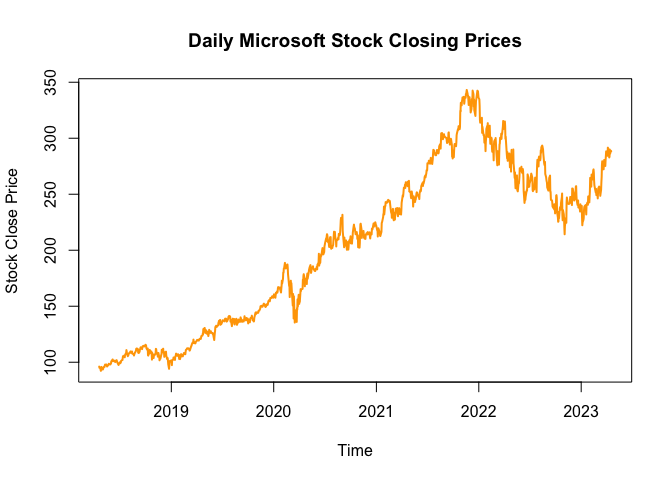

Microsoft Stock
================
2023-04-25

by Luis Osorio

# Microsoft Stock - Price Prediction

## Data Info:

The Data was scraped from Yahoo Finance which you can find
[here.](https://finance.yahoo.com/quote/MSFT/?fr=sycsrp_catchall).

## Goal:

Which model from the two, Long Short Term Memory(LSTM) or Gated
Recurrent Unit (GRU) performs best in predicting microsoft closing
price?

``` r
# load the data
msft.data <- read.csv(file = "~/Stat510/MSFT.csv", header = TRUE, sep = ",")

# print first 5 observations
head(msft.data,5)
```

    ##         Date  Open  High   Low Close Adj.Close   Volume
    ## 1 2018-04-19 96.44 97.07 95.34 96.11  90.70618 23552500
    ## 2 2018-04-20 95.91 96.11 94.05 95.00  89.65860 31154400
    ## 3 2018-04-23 95.74 96.29 94.63 95.35  89.98891 22331800
    ## 4 2018-04-24 96.24 96.47 92.41 93.12  87.88430 34524800
    ## 5 2018-04-25 93.30 93.30 90.28 92.31  87.11984 33729300

``` r
# splitting data into testing and training sets

# formatting the Date column 
msft.data$Year <- as.numeric(format(as.Date(msft.data$Date, format = "%Y-%m-%d"),"%Y"))

train.data <- msft.data[which(msft.data$Year < 2023), 1:5]
test.data <- msft.data[which(msft.data$Year >= 2023), 1:5]
```

``` r
# plotting the closing price
plot(as.POSIXct(msft.data$Date), 
     msft.data$Close, 
     main = "Daily Microsoft Stock Closing Prices", 
     xlab = "Time", 
     ylab = "Stock Close Price", 
   col = 'orange',type = 'l', lwd = 2)
```

<!-- -->

``` r
# glimpse of the test data

glimpse(test.data)
```

    ## Rows: 73
    ## Columns: 5
    ## $ Date  <chr> "2023-01-03", "2023-01-04", "2023-01-05", "2023-01-06", "2023-01…
    ## $ Open  <dbl> 243.08, 232.28, 227.20, 223.00, 226.45, 227.76, 231.29, 235.26, …
    ## $ High  <dbl> 245.75, 232.87, 227.55, 225.76, 231.24, 231.31, 235.95, 239.90, …
    ## $ Low   <dbl> 237.40, 225.96, 221.76, 219.35, 226.41, 227.33, 231.11, 233.56, …
    ## $ Close <dbl> 239.58, 229.10, 222.31, 224.93, 227.12, 228.85, 235.77, 238.51, …

``` r
# plotting training and testing data
plot(as.POSIXct(msft.data$Date), 
     msft.data$Close, 
     main = "Daily Microsoft Stock Closing Prices", 
     xlab = "Time", 
     ylab = "Stock Close Price", 
     pch = "", 
     panel.first = grid())

lines(as.POSIXct(train.data$Date), train.data$Close, lwd = 2, col = "blue")
lines(as.POSIXct(test.data$Date), test.data$Close, lwd = 2, col = "green")
legend("topleft", c("training", "testing"), lty = 1, col = c("blue","green"))
```

<!-- -->

``` r
# scaling prices to fall in [0,1]
price <- msft.data$Close
price.sc <- (price - min(price))/(max(price) - min(price))
```

``` r
# Preparing our train matrix for our models

nsteps <- 73 #width of sliding window
train.matrix <- matrix(nrow = nrow(train.data) - nsteps, ncol = nsteps + 1)
for (i in 1:(nrow(train.data) - nsteps))
  train.matrix[i,] <- price.sc[i:(i + nsteps)]

# creating train.x and train.y 
train.x <- array(train.matrix[,-ncol(train.matrix)],dim = c(nrow(train.matrix),nsteps,1))
train.y <- train.matrix[,ncol(train.matrix)]
```

``` r
#creating test.x and test.y
test.matrix <- matrix(nrow = nrow(test.data), ncol = nsteps + 1)
for (i in 1:nrow(test.data)) 
  test.matrix[i,] <- price.sc[(i + nrow(train.matrix)):(i + nsteps + nrow(train.matrix))]

test.x <- array(test.matrix[,-ncol(test.matrix)],dim = c(nrow(test.matrix),nsteps,1))
test.y <- test.matrix[,ncol(test.matrix)]
```

``` r
#################################################
# LSTM MODEL
##################################################
# loading machine learning libraries
library('tensorflow')
library('keras')

# use_condaenv("r-reticulate", required = TRUE)
```

``` r
# setting our LSTM Model
LSTM.model <- keras_model_sequential() 

# specifying model structure
LSTM.model %>% layer_lstm(input_shape = dim(train.x)[2:3], units = nsteps)
LSTM.model %>% layer_dense(units = 1, activation = "tanh") 
LSTM.model %>% compile(loss = "mean_squared_error")
```

``` r
# training model
epochs <- 5  
for (i in 1:epochs) {
  LSTM.model %>% fit(train.x, train.y, batch_size = 32, epochs = 1)
  LSTM.model %>% reset_states() #clears the hidden states in network after every batch
}
```

``` r
# predicting for testing data
pred.y <- LSTM.model %>% predict(test.x, batch_size = 32)
```

``` r
# rescaling test.y and pred.y back to the original scale
test.y.re <- test.y*(max(price) - min(price)) + min(price)
pred.y.re <- pred.y*(max(price) - min(price)) + min(price)
```

``` r
#computing prediction accuracy
accuracy10 <- ifelse(abs(test.y.re - pred.y.re) < 0.10*test.y.re,1,0) 
accuracy15 <- ifelse(abs(test.y.re - pred.y.re) < 0.15*test.y.re,1,0) 
accuracy20 <- ifelse(abs(test.y.re - pred.y.re) < 0.20*test.y.re,1,0)
```

``` r
print(paste("accuracy within 10%:", round(mean(accuracy10),4)))
```

    ## [1] "accuracy within 10%: 0.9863"

``` r
print(paste("accuracy within 15%:", round(mean(accuracy15),4)))
```

    ## [1] "accuracy within 15%: 1"

``` r
print(paste("accuracy within 20%:", round(mean(accuracy20),4)))
```

    ## [1] "accuracy within 20%: 1"

``` r
# plotting actual and predicted values for testing data
plot(as.POSIXct(test.data$Date), test.y.re, type = "l", lwd = 2, col = "green", 
  main = "Daily Microsoft Stock Actual and Predicted Prices - LSTM Model", 
  xlab = "Time", ylab = "Stock Price", panel.first = grid())
  lines(as.POSIXct(test.data$Date), pred.y.re, lwd = 2, col = "orange")
  legend("topright", c("actual", "predicted"), lty = 1, lwd = 2,
  col = c("green","orange"))
```

<!-- -->

``` r
#################################################
# GRU MODEL
##################################################

# instantiate our model
GRU.model <- keras_model_sequential() 
```

``` r
# specifying model structure
GRU.model %>% layer_gru(input_shape = dim(train.x)[2:3], units = nsteps)
GRU.model %>% layer_dense(units = 1, activation = "tanh") 
GRU.model %>% compile(loss = "mean_squared_error")
```

``` r
# training model
epochs <- 5  
for (i in 1:epochs) {
  GRU.model %>% fit(train.x, train.y, batch_size = 32, epochs = 1)
  GRU.model %>% reset_states() 
}
```

``` r
# predicting for testing data
pred.y <- GRU.model %>% predict(test.x, batch_size = 32)
```

``` r
# rescaling pred.y back to the original scale
pred.y.re <- pred.y*(max(price) - min(price)) + min(price)
```

``` r
#computing prediction accuracy
accuracy10 <- ifelse(abs(test.y.re - pred.y.re) < 0.10*test.y.re,1,0) 
accuracy15 <- ifelse(abs(test.y.re - pred.y.re) < 0.15*test.y.re,1,0) 
accuracy20 <- ifelse(abs(test.y.re - pred.y.re) < 0.20*test.y.re,1,0)
```

``` r
print(paste("accuracy within 10%:", round(mean(accuracy10),4)))
```

    ## [1] "accuracy within 10%: 1"

``` r
print(paste("accuracy within 15%:", round(mean(accuracy15),4)))
```

    ## [1] "accuracy within 15%: 1"

``` r
print(paste("accuracy within 20%:", round(mean(accuracy20),4)))
```

    ## [1] "accuracy within 20%: 1"

``` r
#plotting actual and predicted values for testing data
plot(as.POSIXct(test.data$Date), test.y.re, type = "l", lwd = 2, col = "green", 
  main = "Daily Microsoft Stock Actual and Predicted Prices - GRU Model", 
  xlab = "Time", ylab = "Stock Price", panel.first = grid())
  lines(as.POSIXct(test.data$Date), pred.y.re, lwd = 2, col = "orange")
  legend("topright", c("actual", "predicted"), lty = 1, lwd = 2,
  col = c("green","orange"))
```

<!-- -->
