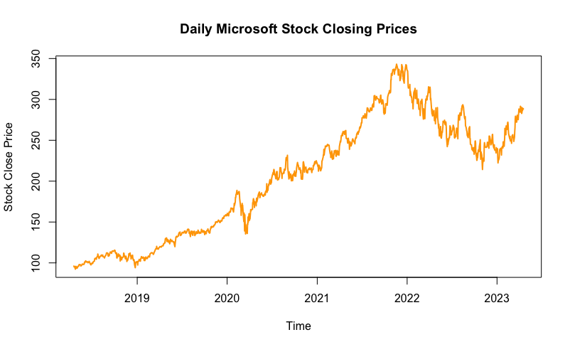
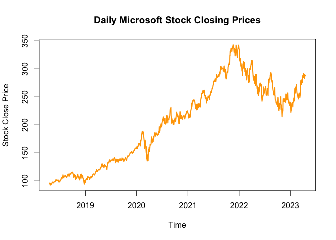

<h1 style="text-align: center;">Microsoft Stock</h1>

  

<!--  --> 

Observe how you can see major economic events in the stock market prices. For example, In the beginning of 2020 around March, the entire country was shut down due to the COVID Pandemic and forced the stock market to crash. You can see the Microsoft Stock price decrease majorly in the start of 2020. Then the Federal Government started printing money to save the stock market from a potential recession and relieve the country of the rapid increase in unemployment rate. Some of the money printed was injected into the stock market and the Federal Treasury kept printing money all the way to 2022. As you can see the Microsoft stock and several other companies greatly benefited from all this Quantitative Easing. After these events, it wasn't long until inflation started to rise from all the Covid relief and the federal government had to stop printing money and start increasing interest rates to combat inflation. We entered the Quantitative Tightening phase where the government started to pull money from the stock markets and the economy, which clearly can be see as the Microsoft stock started to decrease in price after 2022. In very beginning of 2022, inside traders such as politicians coincidentally started to sell their portfolios which further increased the trend of further sellers. Now, Microsoft being very smart began investing into a company in which Elon Musk founded called Open AI, which was a non-profit organization which supplied research into artificial intelligence. Around November 2022, Microsoft announce Bing which was secretly powered by what we called Chat-GPT4, now which many said provided a better search engine than Google. It was a revolutionary move from Microsoft which even caught Lead Tech industry Google to be unprepared, in turn affected Google stock price to decrease. On the other hand Microsoft stock boomed and proved Microsoft stock worthiness along with their Internet Explorer to make a comeback into the browser game. It is said the CEO of Google was unsure on how to respond to Microsoft latest innovation that he had to talk to Original Founding Fathers of Google for advice. They told the CEO of Google that the only way to fight this revolution is to also unleash their own AI which Google has been building for years! This is start of A.I. wars. Chat-GPT being undeniably revolutionary which is changing the way we teach in schools, how to prepare for jobs, and how to write efficiently. Only time will tell where artificial intelligence will takes us. 

