Stat510_Housing_Project
================

# USA Housing Price Prediction

# Introduction

This data set was found in Kaggle which can be downloaded
[here.](https://www.kaggle.com/datasets/vedavyasv/usa-housing)

### Goal:

We want to predict the housing price using Linear Regression techniques
and answer research questions.

### Research Questions:

1.  Which predictors are statistically significant to our linear model?
2.  Are the interaction variables statistically significant to our
    model?
3.  What is the average house price in the united states where the
    average area income is \$50,000, average area house age is 5, an
    area population of 35,000 people, and average are number of rooms is
    6?

### Data Set Attributes:

1.  Average Area Income
2.  Average Area House Age
3.  Average Area Number of Rooms
4.  Average Area Number of Bedrooms
5.  Average Area Population
6.  Address: House Address
7.  Price: House Price

``` r
# Load the data 
df = read.csv('~/Stat510/Stat510_S23/datasets/USA_Housing.csv')
df = data.frame(df)
glimpse(df)
```

    ## Rows: 5,000
    ## Columns: 7
    ## $ Avg..Area.Income             <dbl> 79545.46, 79248.64, 61287.07, 63345.24, 5…
    ## $ Avg..Area.House.Age          <dbl> 5.682861, 6.002900, 5.865890, 7.188236, 5…
    ## $ Avg..Area.Number.of.Rooms    <dbl> 7.009188, 6.730821, 8.512727, 5.586729, 7…
    ## $ Avg..Area.Number.of.Bedrooms <dbl> 4.09, 3.09, 5.13, 3.26, 4.23, 4.04, 3.41,…
    ## $ Area.Population              <dbl> 23086.80, 40173.07, 36882.16, 34310.24, 2…
    ## $ Price                        <dbl> 1059033.6, 1505890.9, 1058988.0, 1260616.…
    ## $ Address                      <chr> "208 Michael Ferry Apt. 674\nLaurabury, N…

# Exploratory Data Analysis

``` r
# data dimensions
dim(df)
```

    ## [1] 5000    7

  
We are given a total of 7 features and 500 observations for this data
set.  

``` r
# check for missing values in the columns
colSums(is.na(df))
```

    ##             Avg..Area.Income          Avg..Area.House.Age 
    ##                            0                            0 
    ##    Avg..Area.Number.of.Rooms Avg..Area.Number.of.Bedrooms 
    ##                            0                            0 
    ##              Area.Population                        Price 
    ##                            0                            0 
    ##                      Address 
    ##                            0

``` r
# check for duplicates
sum(duplicated(df))
```

    ## [1] 0

``` r
# statistical summary using skim function from skimr
skim(df)
```

|                                                  |      |
|:-------------------------------------------------|:-----|
| Name                                             | df   |
| Number of rows                                   | 5000 |
| Number of columns                                | 7    |
| \_\_\_\_\_\_\_\_\_\_\_\_\_\_\_\_\_\_\_\_\_\_\_   |      |
| Column type frequency:                           |      |
| character                                        | 1    |
| numeric                                          | 6    |
| \_\_\_\_\_\_\_\_\_\_\_\_\_\_\_\_\_\_\_\_\_\_\_\_ |      |
| Group variables                                  | None |

Data summary

**Variable type: character**

| skim_variable | n_missing | complete_rate | min | max | empty | n_unique | whitespace |
|:--------------|----------:|--------------:|----:|----:|------:|---------:|-----------:|
| Address       |         0 |             1 |  21 |  68 |     0 |     5000 |          0 |

**Variable type: numeric**

| skim_variable                | n_missing | complete_rate |       mean |        sd |       p0 |       p25 |        p50 |        p75 |       p100 | hist  |
|:-----------------------------|----------:|--------------:|-----------:|----------:|---------:|----------:|-----------:|-----------:|-----------:|:------|
| Avg..Area.Income             |         0 |             1 |   68583.11 |  10657.99 | 17796.63 |  61480.56 |   68804.29 |   75783.34 |  107701.75 | ▁▁▇▆▁ |
| Avg..Area.House.Age          |         0 |             1 |       5.98 |      0.99 |     2.64 |      5.32 |       5.97 |       6.65 |       9.52 | ▁▃▇▃▁ |
| Avg..Area.Number.of.Rooms    |         0 |             1 |       6.99 |      1.01 |     3.24 |      6.30 |       7.00 |       7.67 |      10.76 | ▁▃▇▃▁ |
| Avg..Area.Number.of.Bedrooms |         0 |             1 |       3.98 |      1.23 |     2.00 |      3.14 |       4.05 |       4.49 |       6.50 | ▅▇▇▃▃ |
| Area.Population              |         0 |             1 |   36163.52 |   9925.65 |   172.61 |  29403.93 |   36199.41 |   42861.29 |   69621.71 | ▁▃▇▅▁ |
| Price                        |         0 |             1 | 1232072.65 | 353117.63 | 15938.66 | 997577.14 | 1232669.38 | 1471210.20 | 2469065.59 | ▁▃▇▃▁ |

``` r
# convert categorical variables into factors
factor_names = c('Address')
df = df |> mutate_at(factor_names, as.factor)
```

``` r
# check column data types
str(df)
```

    ## 'data.frame':    5000 obs. of  7 variables:
    ##  $ Avg..Area.Income            : num  79545 79249 61287 63345 59982 ...
    ##  $ Avg..Area.House.Age         : num  5.68 6 5.87 7.19 5.04 ...
    ##  $ Avg..Area.Number.of.Rooms   : num  7.01 6.73 8.51 5.59 7.84 ...
    ##  $ Avg..Area.Number.of.Bedrooms: num  4.09 3.09 5.13 3.26 4.23 4.04 3.41 2.42 2.3 6.1 ...
    ##  $ Area.Population             : num  23087 40173 36882 34310 26354 ...
    ##  $ Price                       : num  1059034 1505891 1058988 1260617 630943 ...
    ##  $ Address                     : Factor w/ 5000 levels "000 Adkins Crescent\nSouth Teresa, AS 49642-1348",..: 963 864 4070 4957 4899 312 2148 4345 4969 4806 ...

# Data Visualizations

``` r
# correlation matrix plot

# color palette 
col <- colorRampPalette(c("#BB4444", "#EE9988", "#FFFFFF", "#77AADD", "#4477AA"))

# extract numeric columns only
numeric_cols <- sapply(df, is.numeric)
df_numeric <- df[, numeric_cols]

corr_matrix <- cor(df_numeric)
corrplot(corr_matrix, method = 'color', tl.cex = 0.5, title = "Correlation Matrix",
         mar=c(0,0,1,0), addCoef.col = 'grey50')
```

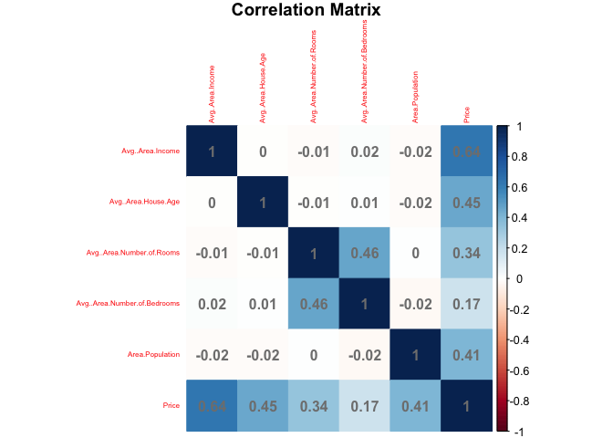<!-- -->  
From the correlation matrix we can see that the Price of the House is
high correlated with the average area income, average area house age,
area population, and average area number of rooms. Therefore they must
be significant predictors for our linear regression model.  

``` r
# scatter plot matrix
ggpairs(df_numeric)
```

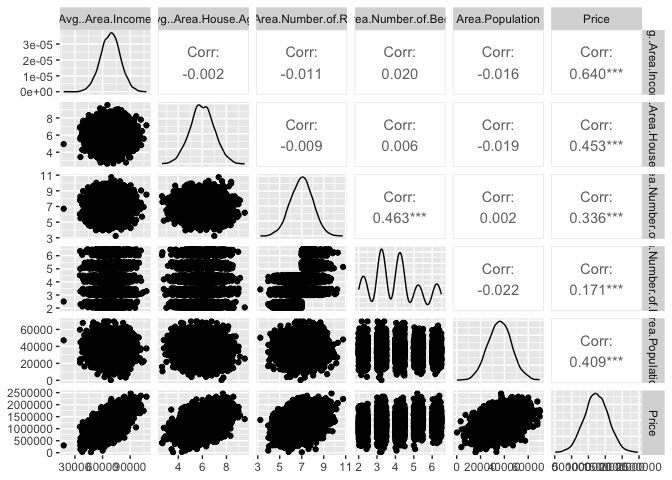<!-- -->  
There seems to be a positive relationship between price and all
significant predictors that are highly correlated with price. The
significant predictors mentioned above from the correlation matrix.  

``` r
# Histogram on Average Area Income
ggplot(df, aes(x = Avg..Area.Income)) +                         
  geom_histogram(aes(y = after_stat(density)), bins = 40, fill = "lightblue") +
  geom_density(alpha = 0.1, fill = "lightgreen") +
  labs(title="Average Area Income Density Plot",x="Average Area Income")
```

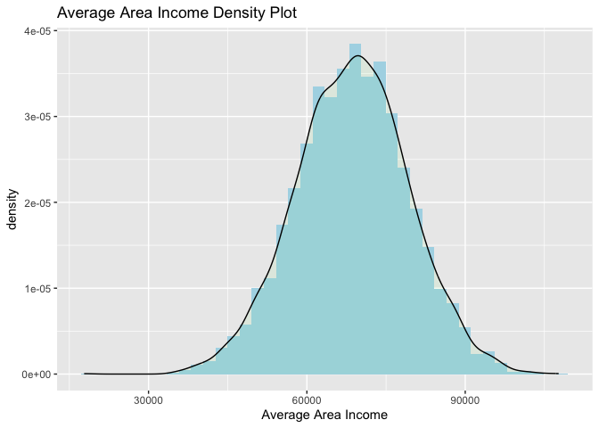<!-- -->  
The average area income of the observations in our data set seem to
follow a normal distribution where the mean seems to be around \$68,583
and with a standard deviation of \$10,658.  

``` r
# Histogram on Average Area House Age
ggplot(df, aes(x = Avg..Area.House.Age)) +                         
  geom_histogram(aes(y = after_stat(density)), bins = 40, fill = "lightblue") +
  geom_density(alpha = 0.1, fill = "lightgreen") +
  labs(title="Average Area House Age Density Plot",x="Average Area House Age")
```

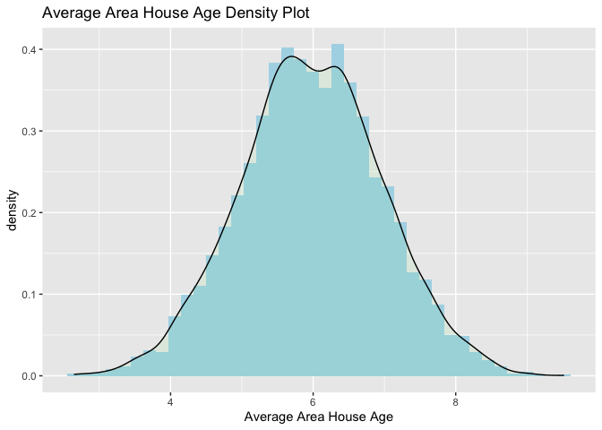<!-- -->  
The average area house age of the observations also seem to follow a
normal distribution, where the mean is 6 years with standard deviation
of a single year.  

``` r
# Histogram on Area Population
ggplot(df, aes(x = Area.Population)) +                         
  geom_histogram(aes(y = after_stat(density)), bins = 40, fill = "lightblue") +
  geom_density(alpha = 0.1, fill = "purple") +
  labs(title="Area Population Density Plot",x="Area Population")
```

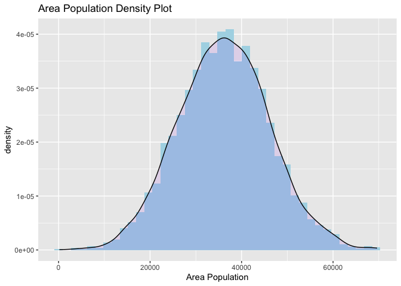<!-- -->  
The average area population also follows a normal distribution where the
average of the distribution is 36,163 people with standard deviation of
9,925 people.  

``` r
# Histogram on Average Area Number of Bedrooms
ggplot(df, aes(x = Avg..Area.Number.of.Bedrooms)) +                         
  geom_histogram(aes(y = after_stat(density)), bins = 40, fill = "lightblue") +
  geom_density(alpha = 0.1, fill = "lightgreen") +
  labs(title="Average Area Number of Bedrooms Density Plot",x="Average Area Number of Bedrooms")
```

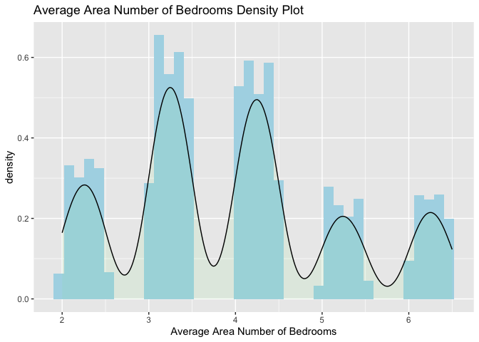<!-- -->  
From the histogram above we can that most houses in our data set have
evither 3 or 4 bedrooms compared to 2,5, or 6 bedroom houses.  

``` r
# Histogram on Average Area Number of Rooms
ggplot(df, aes(x = Avg..Area.Number.of.Rooms)) +                         
  geom_histogram(aes(y = after_stat(density)), bins = 40, fill = "lightblue") +
  geom_density(alpha = 0.1, fill = "purple") +
  labs(title="Average Area Number of Rooms Density Plot",x="Average Area Number of Rooms")
```

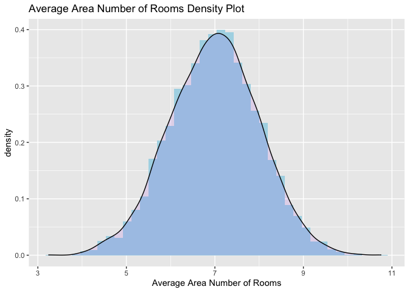<!-- -->

``` r
# Histogram on Average Area Number of Rooms
ggplot(df, aes(x = Price)) +                         
  geom_histogram(aes(y = after_stat(density)), bins = 40, fill = "lightblue") +
  geom_density(alpha = 0.1, fill = "purple") +
  labs(title="House Selling Price Density Plot",x="Price")
```

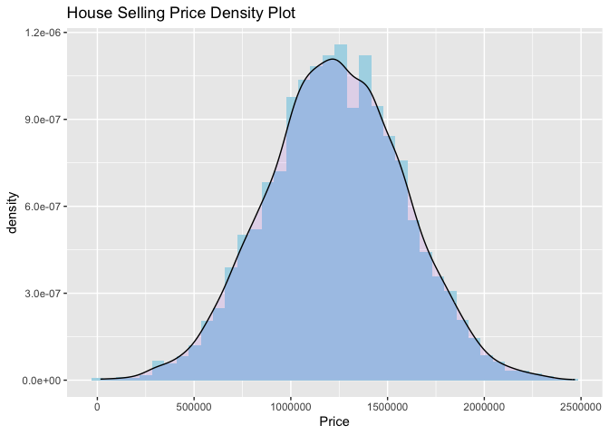<!-- -->  
Now our target variable is the selling price of the house, where we can
see it also fits a normal distribution. Where the average of our
distribution is \$1,232,073 with a standard deviation of \$353,117.
These are not cheap houses. Note, observation of houses are randomly
chosen across all United States.  

# Linear Regression Modeling

``` r
# remove the categorical column since each address is unique 
df = df |> dplyr::select(-Address)
```

``` r
# split the data
# split train and test sets to a 80/20 split
n = nrow(df)
prop = .80
set.seed(1)
train_id = sample(1:n, size = round(n*prop), replace = FALSE)
test_id = (1:n)[-which(1:n %in% train_id)]
train_set = df[train_id, ]
test_set = df[test_id, ]
```

## Linear Fit with all Predictors

Research Question: 1. Which predictors are statistically significant to
our linear model?

``` r
# Fit a Linear Regression Model with all predictors 
linear.fit = lm(Price ~ ., data = df)
summary(linear.fit)
```

    ## 
    ## Call:
    ## lm(formula = Price ~ ., data = df)
    ## 
    ## Residuals:
    ##     Min      1Q  Median      3Q     Max 
    ## -337020  -70236     320   69175  361870 
    ## 
    ## Coefficients:
    ##                                Estimate Std. Error  t value Pr(>|t|)    
    ## (Intercept)                  -2.637e+06  1.716e+04 -153.708   <2e-16 ***
    ## Avg..Area.Income              2.158e+01  1.343e-01  160.656   <2e-16 ***
    ## Avg..Area.House.Age           1.656e+05  1.443e+03  114.754   <2e-16 ***
    ## Avg..Area.Number.of.Rooms     1.207e+05  1.605e+03   75.170   <2e-16 ***
    ## Avg..Area.Number.of.Bedrooms  1.651e+03  1.309e+03    1.262    0.207    
    ## Area.Population               1.520e+01  1.442e-01  105.393   <2e-16 ***
    ## ---
    ## Signif. codes:  0 '***' 0.001 '**' 0.01 '*' 0.05 '.' 0.1 ' ' 1
    ## 
    ## Residual standard error: 101200 on 4994 degrees of freedom
    ## Multiple R-squared:  0.918,  Adjusted R-squared:  0.9179 
    ## F-statistic: 1.119e+04 on 5 and 4994 DF,  p-value: < 2.2e-16

  
Using t-test to check the statistically significant predictors, we
conduct a hypothesis test where the null hypothesis is
$H_0: \beta_i = 0$ and our alternative is $H_a: \beta_i \neq 0$ where
$i=$ all predictors. Now using a significance level of $\alpha = 0.05$,
we can see that the the only predictors that fail to reject our null
hypothesis, $p-value > \alpha$, is the attribute average area number of
bedrooms. Hence, we can say that average area number of bedrooms is
statistically insignificant to our linear model.  

### Residual Analysis on Linear Fit 1

``` r
# residual vs fit plot for our linear model
residuals = linear.fit$residuals
fitted_values = linear.fit$fitted.values
plot(fitted_values,residuals, main = 'Residual Vs Fit Plot (Linear Fit)', 
     xlab = 'Fitted Values', ylab = 'Residuals', col = 'chocolate1')
abline(0,0, lty=3)
```

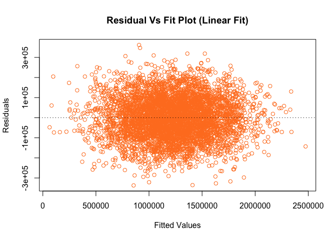<!-- -->  
We run a residual analysis on the linear model that contains all
variables as predictors. Observing the residual versus fit plot we can
see that the equal variance assumption across the resuduals seems to be
met since the points fit inside a horizontal band. Now, the linearity
assumption where the points seem to bounce off the zero line randomly
also seems to be met.  

``` r
# QQ-plot on residuals for our linear model
qqnorm(residuals, pch = 1, frame = TRUE)
qqline(residuals, col = "steelblue", lwd = 2)
```

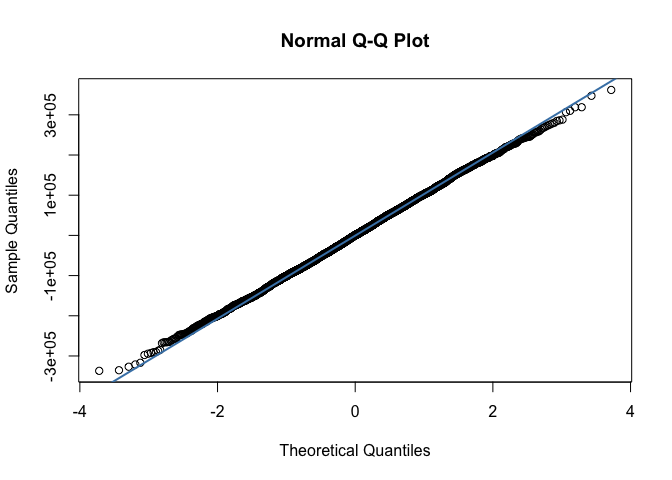<!-- -->  
Now, we check normality condition on the residuals and we can see from
the QQ-plot that the residuals all seem to lie on slanted line. Hence,
the errors are normally distributed. Hence, we can say the Linear
Regression model using all variables as predictors is perfectly adequate
to answering research questions.  

## Linear Fit 2 with Significant Predictors

``` r
# Fitting the Linear model with only significant predictors
# we got rid of the average area number of bedrooms
linear.fit2 = lm(Price ~ Avg..Area.Income + Avg..Area.House.Age + Avg..Area.Number.of.Rooms +
                  Area.Population, data = df)
summary(linear.fit2)
```

    ## 
    ## Call:
    ## lm(formula = Price ~ Avg..Area.Income + Avg..Area.House.Age + 
    ##     Avg..Area.Number.of.Rooms + Area.Population, data = df)
    ## 
    ## Residuals:
    ##     Min      1Q  Median      3Q     Max 
    ## -338419  -70058     132   69074  362025 
    ## 
    ## Coefficients:
    ##                             Estimate Std. Error t value Pr(>|t|)    
    ## (Intercept)               -2.638e+06  1.716e+04 -153.73   <2e-16 ***
    ## Avg..Area.Income           2.158e+01  1.343e-01  160.74   <2e-16 ***
    ## Avg..Area.House.Age        1.657e+05  1.443e+03  114.77   <2e-16 ***
    ## Avg..Area.Number.of.Rooms  1.216e+05  1.423e+03   85.48   <2e-16 ***
    ## Area.Population            1.520e+01  1.442e-01  105.39   <2e-16 ***
    ## ---
    ## Signif. codes:  0 '***' 0.001 '**' 0.01 '*' 0.05 '.' 0.1 ' ' 1
    ## 
    ## Residual standard error: 101200 on 4995 degrees of freedom
    ## Multiple R-squared:  0.918,  Adjusted R-squared:  0.9179 
    ## F-statistic: 1.398e+04 on 4 and 4995 DF,  p-value: < 2.2e-16

  
Comparing the summary table of the linear model that uses all variables
as predictors and the linear model where we removed the statistically
insignificant predictor, we saw no change in the $R^2$ and adjusted
$R^2$ value. Hence, if we want a more efficient and significant model
the model without the significant predictor will perhaps be better off.
However, further analysis must be investigated to see if the model is
worthy of answering research questions.  

### Residual Analysis on Linear Fit 2

``` r
# residual vs fit plot for our linear model with significant predictors
residuals = linear.fit2$residuals
fitted_values = linear.fit2$fitted.values
plot(fitted_values,residuals, main = 'Residual Vs Fit Plot (Linear Fit)', 
     xlab = 'Fitted Values', ylab = 'Residuals', col = 'chocolate1')
abline(0,0, lty=3)
```

<!-- -->  
Now running the residual versus fit plot on the linear model where we
removed a predictor, we can see the points seem to bounce randomly off
the zero line. Hence, we can say the linearity assumption of our model
seems to be met. Similarly, the points seem to fit a horizontal band
where there is no fanning pattern, thus we can also say the equal
variance assumption on the residuals is also met. Now, we check the
residuals versus predictors plot to see any missing non-linear trends.  
  

``` r
# Residual versus Average area Income
plot(df$Avg..Area.Income,residuals, main = 'Residual Vs Avg. Area Income', 
     xlab = 'Avg. Area Income', ylab = 'Residuals', col = 'chocolate2')
abline(0,0, lty=3)
```

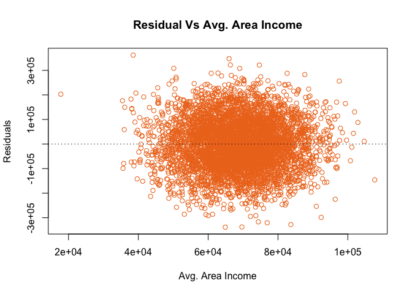<!-- -->  
Observing the residual versus average area income the assumption of
linearity seems to also be met where the points bounce randomly off the
zero line. Also the assumption of equal variance seem to be met.
However, in this plot we can observe an outlier where the average area
income is about \$20,000.  

``` r
# Resudlas versus Average Area House Age
plot(df$Avg..Area.House.Age,residuals, main = 'Residual Vs Avg. Area House Age', 
     xlab = 'Avg. Area House Age', ylab = 'Residuals', col = 'chocolate2')
abline(0,0, lty=3)
```

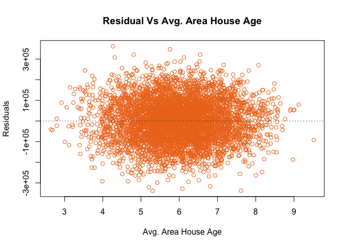<!-- -->  
Now investigating the residual versus average area house age we can also
argue that the linearity and equal variance assumptions are also met.  

``` r
# Residulas versus Area Population
plot(df$Area.Population,residuals, main = 'Residual Vs Area Population', 
     xlab = 'Area Population', ylab = 'Residuals', col = 'chocolate2')
abline(0,0, lty=3)
```

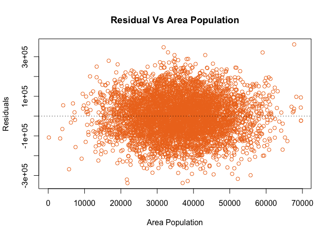<!-- -->  
Now investigating the residual versus area population we can also argue
that the linearity and equal variance assumptions are also met.  

``` r
# Residulas versus Average Area Number of Bedrooms
plot(df$Avg..Area.Number.of.Bedrooms,residuals, main = 'Residual Vs Avg. Area Number of Bedrooms', 
     xlab = 'Avg. Area Number of Bedrooms', ylab = 'Residuals', col = 'chocolate2')
abline(0,0, lty=3)
```

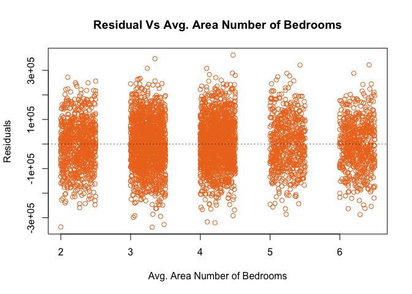<!-- -->

``` r
# QQ-plot on residuals for our linear model
qqnorm(residuals, pch = 1, frame = TRUE)
qqline(residuals, col = "steelblue", lwd = 2)
```

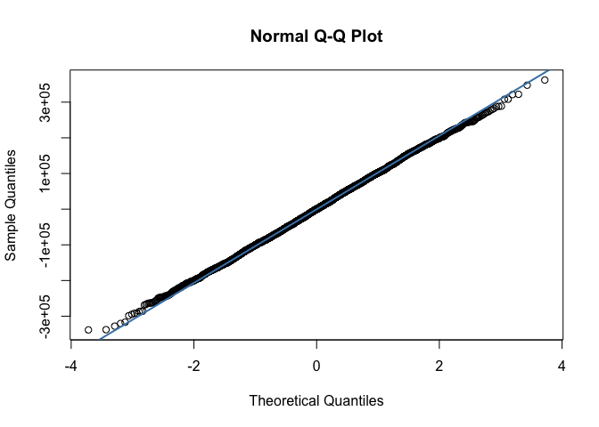<!-- -->

``` r
# test for normality on residuals for our linear model
shapiro.test(residuals)
```

    ## 
    ##  Shapiro-Wilk normality test
    ## 
    ## data:  residuals
    ## W = 0.99957, p-value = 0.341

  
From the QQ-Plot above we can see that our residuals lie on the slanted
line, hence they seem to be normally distributed. Now conducting a
Shapiro-Test, where our null hypothesis is that the vector is Normally
Distributed versus our alternative hypothesis where our 1d-array is not
normally distributed. Now using a significance level of $\alpha = 0.05$,
we can see our p-value is 0.341. Thus, we have $p-value > \alpha$,
therefore we fail to reject our null and conclude that the errors are
normally distributed. Hence, we conclude the the linear model with the
removed predictor is worthy of answering research questions.  

``` r
# Transformation Attempt
linear.transform = lm(Price ~ log(Avg..Area.Income) + log(Avg..Area.House.Age) + 
                      log(Avg..Area.Number.of.Rooms) + log(Area.Population), data = df)
summary(linear.transform)
```

    ## 
    ## Call:
    ## lm(formula = Price ~ log(Avg..Area.Income) + log(Avg..Area.House.Age) + 
    ##     log(Avg..Area.Number.of.Rooms) + log(Area.Population), data = df)
    ## 
    ## Residuals:
    ##     Min      1Q  Median      3Q     Max 
    ## -382670  -79540   -4767   75392 1784022 
    ## 
    ## Coefficients:
    ##                                 Estimate Std. Error t value Pr(>|t|)    
    ## (Intercept)                    -22519652     131837 -170.81   <2e-16 ***
    ## log(Avg..Area.Income)            1409817      10332  136.46   <2e-16 ***
    ## log(Avg..Area.House.Age)          945839       9684   97.67   <2e-16 ***
    ## log(Avg..Area.Number.of.Rooms)    820280      11237   73.00   <2e-16 ***
    ## log(Area.Population)              459862       5275   87.18   <2e-16 ***
    ## ---
    ## Signif. codes:  0 '***' 0.001 '**' 0.01 '*' 0.05 '.' 0.1 ' ' 1
    ## 
    ## Residual standard error: 117800 on 4995 degrees of freedom
    ## Multiple R-squared:  0.8888, Adjusted R-squared:  0.8887 
    ## F-statistic:  9978 on 4 and 4995 DF,  p-value: < 2.2e-16

``` r
# residual vs fit plot for our Transformed linear model
residuals = linear.transform$residuals
fitted_values = linear.transform$fitted.values
plot(fitted_values,residuals, main = 'Residual Vs Fit Plot (Linear Fit)', 
     xlab = 'Fitted Values', ylab = 'Residuals', col = 'chocolate1')
abline(0,0, lty=3)
```

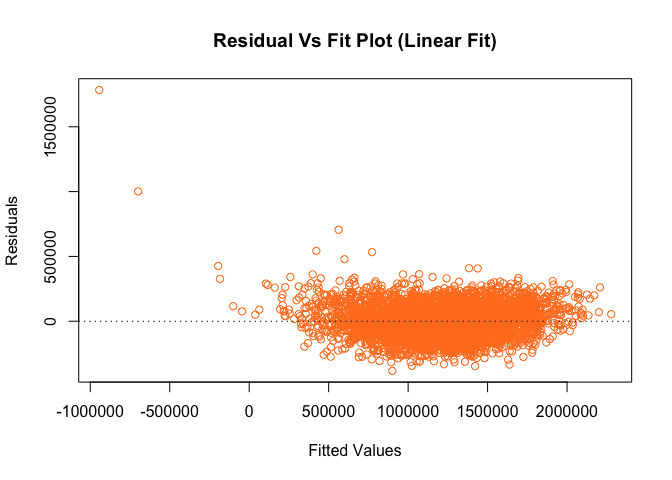<!-- -->

``` r
# QQ-plot on residuals for our Transformed linear model
qqnorm(residuals, pch = 1, frame = TRUE)
qqline(residuals, col = "steelblue", lwd = 2)
```

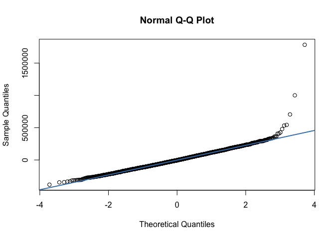<!-- -->

``` r
# test for normality on residuals for our transformed linear model
shapiro.test(residuals)
```

    ## 
    ##  Shapiro-Wilk normality test
    ## 
    ## data:  residuals
    ## W = 0.96471, p-value < 2.2e-16

  
When attempting some transformation methods to our model, the residual
analysis and QQ-plot failed to meet some of the assumption requirements.
For example, the linearity and equal variance assumptions where violated
and the errors were no longer normally distributed. We conclude that
transformation methods did not perform well in our model.  

# General Linear F-Test

``` r
# Reduced Linear Model
reduced.model = lm(Price ~ Avg..Area.Income + Avg..Area.House.Age + Avg..Area.Number.of.Rooms +
                  Area.Population, data = df)

# Full Linear Model
full.model = lm(Price ~ Avg..Area.Income + Avg..Area.House.Age + Avg..Area.Number.of.Rooms +
                  Area.Population + Avg..Area.Number.of.Bedrooms, data = df)

# General Linear F-Test 
anova(reduced.model, full.model)
```

    ## Analysis of Variance Table
    ## 
    ## Model 1: Price ~ Avg..Area.Income + Avg..Area.House.Age + Avg..Area.Number.of.Rooms + 
    ##     Area.Population
    ## Model 2: Price ~ Avg..Area.Income + Avg..Area.House.Age + Avg..Area.Number.of.Rooms + 
    ##     Area.Population + Avg..Area.Number.of.Bedrooms
    ##   Res.Df        RSS Df  Sum of Sq      F Pr(>F)
    ## 1   4995 5.1115e+13                            
    ## 2   4994 5.1099e+13  1 1.6288e+10 1.5919 0.2071

  
Here we check the validity of the predictor average area number of
bedrooms using the General Linear F-test. From the T-test we saw that
average area number of bedrooms was a statistically insignificant
predictor, here we test which model is statistically significant, the
model with the predictor average area number of bedrooms or the model
without the predictor. The results should be the same as the T-test,
since the hypothesis test for our general linear f-test would be similar
$H_0: \beta_i = 0$ and $H_a: \beta_i \neq 0$, where $i=$ average area
number of bedrooms. In other words our null hypothesis would be $H_0:$
Reduced Model and our alternative would be $H_a:$ Full Model. Now, from
the general linear f-test we got a p-value of 0.20, and using a
significance level $\alpha = 0.05$ we can see we fail to reject our null
hypothesis. Concluding the reduced model is more significant or the
average area number of bedrooms is a insignificant predictor.  

Research Question: 2. Are the interaction variables statistically
significant to our model?

``` r
# Reduced Linear Model
reduced.model = lm(Price ~ Avg..Area.Income + Avg..Area.House.Age + Avg..Area.Number.of.Rooms +
                  Area.Population, data = df)

# Full Linear Model
full.model = lm(Price ~ Avg..Area.Income + Avg..Area.House.Age + Avg..Area.Number.of.Rooms +
                  Area.Population + Avg..Area.Income*Avg..Area.House.Age +
                  Avg..Area.Income*Avg..Area.Number.of.Rooms +
                  Avg..Area.Income*Area.Population + Avg..Area.House.Age*Avg..Area.Number.of.Rooms + 
                  Avg..Area.House.Age*Area.Population +
                  Avg..Area.Number.of.Rooms*Area.Population, data = df)

# Summary of Full Model
summary(full.model)
```

    ## 
    ## Call:
    ## lm(formula = Price ~ Avg..Area.Income + Avg..Area.House.Age + 
    ##     Avg..Area.Number.of.Rooms + Area.Population + Avg..Area.Income * 
    ##     Avg..Area.House.Age + Avg..Area.Income * Avg..Area.Number.of.Rooms + 
    ##     Avg..Area.Income * Area.Population + Avg..Area.House.Age * 
    ##     Avg..Area.Number.of.Rooms + Avg..Area.House.Age * Area.Population + 
    ##     Avg..Area.Number.of.Rooms * Area.Population, data = df)
    ## 
    ## Residuals:
    ##     Min      1Q  Median      3Q     Max 
    ## -338346  -70005    -198   68704  352508 
    ## 
    ## Coefficients:
    ##                                                 Estimate Std. Error t value
    ## (Intercept)                                   -2.723e+06  1.219e+05 -22.338
    ## Avg..Area.Income                               2.216e+01  1.358e+00  16.314
    ## Avg..Area.House.Age                            1.687e+05  1.496e+04  11.271
    ## Avg..Area.Number.of.Rooms                      1.349e+05  1.348e+04  10.011
    ## Area.Population                                1.579e+01  1.624e+00   9.723
    ## Avg..Area.Income:Avg..Area.House.Age           5.513e-02  1.362e-01   0.405
    ## Avg..Area.Income:Avg..Area.Number.of.Rooms    -1.573e-01  1.323e-01  -1.189
    ## Avg..Area.Income:Area.Population               5.332e-06  1.351e-05   0.395
    ## Avg..Area.House.Age:Avg..Area.Number.of.Rooms -2.798e+02  1.432e+03  -0.195
    ## Avg..Area.House.Age:Area.Population           -1.329e-01  1.409e-01  -0.943
    ## Avg..Area.Number.of.Rooms:Area.Population     -2.392e-02  1.422e-01  -0.168
    ##                                               Pr(>|t|)    
    ## (Intercept)                                     <2e-16 ***
    ## Avg..Area.Income                                <2e-16 ***
    ## Avg..Area.House.Age                             <2e-16 ***
    ## Avg..Area.Number.of.Rooms                       <2e-16 ***
    ## Area.Population                                 <2e-16 ***
    ## Avg..Area.Income:Avg..Area.House.Age             0.686    
    ## Avg..Area.Income:Avg..Area.Number.of.Rooms       0.234    
    ## Avg..Area.Income:Area.Population                 0.693    
    ## Avg..Area.House.Age:Avg..Area.Number.of.Rooms    0.845    
    ## Avg..Area.House.Age:Area.Population              0.346    
    ## Avg..Area.Number.of.Rooms:Area.Population        0.866    
    ## ---
    ## Signif. codes:  0 '***' 0.001 '**' 0.01 '*' 0.05 '.' 0.1 ' ' 1
    ## 
    ## Residual standard error: 101200 on 4989 degrees of freedom
    ## Multiple R-squared:  0.918,  Adjusted R-squared:  0.9179 
    ## F-statistic:  5588 on 10 and 4989 DF,  p-value: < 2.2e-16

``` r
# General Linear F-Test 
anova(reduced.model, full.model)
```

    ## Analysis of Variance Table
    ## 
    ## Model 1: Price ~ Avg..Area.Income + Avg..Area.House.Age + Avg..Area.Number.of.Rooms + 
    ##     Area.Population
    ## Model 2: Price ~ Avg..Area.Income + Avg..Area.House.Age + Avg..Area.Number.of.Rooms + 
    ##     Area.Population + Avg..Area.Income * Avg..Area.House.Age + 
    ##     Avg..Area.Income * Avg..Area.Number.of.Rooms + Avg..Area.Income * 
    ##     Area.Population + Avg..Area.House.Age * Avg..Area.Number.of.Rooms + 
    ##     Avg..Area.House.Age * Area.Population + Avg..Area.Number.of.Rooms * 
    ##     Area.Population
    ##   Res.Df        RSS Df  Sum of Sq      F Pr(>F)
    ## 1   4995 5.1115e+13                            
    ## 2   4989 5.1087e+13  6 2.8021e+10 0.4561 0.8411

  
Here we test for the numerical interactions between the variables, where
our Full Linear Model contains all the interactions variables between
the predictors and the reduced model contains no interaction variables.
Conducting a hypothesis test where $H_0:$ Reduced Model and $H_a$ Full
Model. We can see that the general linear f-test returned a p-value of
0.8411 which is greater than our significance level of 0.05. Hence, we
also fail to reject the null hypothesis and conclude the reduced model
is the statistically significant model of the two. Hence, the
interactions between the numerical predictors were not statistically
significant to our model.  

# Best Subset Model

``` r
# Step-Wise Regression using AIC 
mod0 = lm(Price ~ 1, data = df)
mod.upper = lm(Price ~ Avg..Area.Income + Avg..Area.House.Age + Avg..Area.Number.of.Rooms +
                  Area.Population + Avg..Area.Number.of.Bedrooms, data = df)
step(mod0, scope = list(lower = mod0, upper = mod.upper), k = 2)
```

    ## Start:  AIC=127746.6
    ## Price ~ 1
    ## 
    ##                                Df  Sum of Sq        RSS    AIC
    ## + Avg..Area.Income              1 2.5511e+14 3.6823e+14 125117
    ## + Avg..Area.House.Age           1 1.2766e+14 4.9568e+14 126603
    ## + Area.Population               1 1.0405e+14 5.1929e+14 126835
    ## + Avg..Area.Number.of.Rooms     1 7.0232e+13 5.5310e+14 127151
    ## + Avg..Area.Number.of.Bedrooms  1 1.8242e+13 6.0509e+14 127600
    ## <none>                                       6.2334e+14 127747
    ## 
    ## Step:  AIC=125116.7
    ## Price ~ Avg..Area.Income
    ## 
    ##                                Df  Sum of Sq        RSS    AIC
    ## + Avg..Area.House.Age           1 1.2838e+14 2.3985e+14 122975
    ## + Area.Population               1 1.0943e+14 2.5880e+14 123355
    ## + Avg..Area.Number.of.Rooms     1 7.3225e+13 2.9500e+14 124010
    ## + Avg..Area.Number.of.Bedrooms  1 1.5648e+13 3.5258e+14 124902
    ## <none>                                       3.6823e+14 125117
    ## - Avg..Area.Income              1 2.5511e+14 6.2334e+14 127747
    ## 
    ## Step:  AIC=122975.2
    ## Price ~ Avg..Area.Income + Avg..Area.House.Age
    ## 
    ##                                Df  Sum of Sq        RSS    AIC
    ## + Area.Population               1 1.1397e+14 1.2588e+14 119754
    ## + Avg..Area.Number.of.Rooms     1 7.5076e+13 1.6477e+14 121100
    ## + Avg..Area.Number.of.Bedrooms  1 1.5099e+13 2.2475e+14 122652
    ## <none>                                       2.3985e+14 122975
    ## - Avg..Area.House.Age           1 1.2838e+14 3.6823e+14 125117
    ## - Avg..Area.Income              1 2.5583e+14 4.9568e+14 126603
    ## 
    ## Step:  AIC=119753.8
    ## Price ~ Avg..Area.Income + Avg..Area.House.Age + Area.Population
    ## 
    ##                                Df  Sum of Sq        RSS    AIC
    ## + Avg..Area.Number.of.Rooms     1 7.4765e+13 5.1115e+13 115250
    ## + Avg..Area.Number.of.Bedrooms  1 1.6965e+13 1.0891e+14 119032
    ## <none>                                       1.2588e+14 119754
    ## - Area.Population               1 1.1397e+14 2.3985e+14 122975
    ## - Avg..Area.House.Age           1 1.3292e+14 2.5880e+14 123355
    ## - Avg..Area.Income              1 2.6135e+14 3.8723e+14 125370
    ## 
    ## Step:  AIC=115249.5
    ## Price ~ Avg..Area.Income + Avg..Area.House.Age + Area.Population + 
    ##     Avg..Area.Number.of.Rooms
    ## 
    ##                                Df  Sum of Sq        RSS    AIC
    ## <none>                                       5.1115e+13 115250
    ## + Avg..Area.Number.of.Bedrooms  1 1.6288e+10 5.1099e+13 115250
    ## - Avg..Area.Number.of.Rooms     1 7.4765e+13 1.2588e+14 119754
    ## - Area.Population               1 1.1366e+14 1.6477e+14 121100
    ## - Avg..Area.House.Age           1 1.3479e+14 1.8591e+14 121703
    ## - Avg..Area.Income              1 2.6441e+14 3.1552e+14 124348

    ## 
    ## Call:
    ## lm(formula = Price ~ Avg..Area.Income + Avg..Area.House.Age + 
    ##     Area.Population + Avg..Area.Number.of.Rooms, data = df)
    ## 
    ## Coefficients:
    ##               (Intercept)           Avg..Area.Income  
    ##                -2.638e+06                  2.158e+01  
    ##       Avg..Area.House.Age            Area.Population  
    ##                 1.657e+05                  1.520e+01  
    ## Avg..Area.Number.of.Rooms  
    ##                 1.216e+05

  
Now, using step wise regression model using AIC as a metric to
determining the best predictors in order we can see that the best model
is the same where we conducted the general linear f-test and t-tests.  

``` r
# Step-Wise Regression using AIC 
mod0 = lm(Price ~ 1, data = df)
mod.upper = lm(Price ~ Avg..Area.Income + Avg..Area.House.Age + Avg..Area.Number.of.Rooms +
                  Area.Population + Avg..Area.Number.of.Bedrooms, data = df)
step(mod0, scope = list(lower = mod0, upper = mod.upper), k = log(5000))
```

    ## Start:  AIC=127753.1
    ## Price ~ 1
    ## 
    ##                                Df  Sum of Sq        RSS    AIC
    ## + Avg..Area.Income              1 2.5511e+14 3.6823e+14 125130
    ## + Avg..Area.House.Age           1 1.2766e+14 4.9568e+14 126616
    ## + Area.Population               1 1.0405e+14 5.1929e+14 126848
    ## + Avg..Area.Number.of.Rooms     1 7.0232e+13 5.5310e+14 127164
    ## + Avg..Area.Number.of.Bedrooms  1 1.8242e+13 6.0509e+14 127613
    ## <none>                                       6.2334e+14 127753
    ## 
    ## Step:  AIC=125129.7
    ## Price ~ Avg..Area.Income
    ## 
    ##                                Df  Sum of Sq        RSS    AIC
    ## + Avg..Area.House.Age           1 1.2838e+14 2.3985e+14 122995
    ## + Area.Population               1 1.0943e+14 2.5880e+14 123375
    ## + Avg..Area.Number.of.Rooms     1 7.3225e+13 2.9500e+14 124030
    ## + Avg..Area.Number.of.Bedrooms  1 1.5648e+13 3.5258e+14 124921
    ## <none>                                       3.6823e+14 125130
    ## - Avg..Area.Income              1 2.5511e+14 6.2334e+14 127753
    ## 
    ## Step:  AIC=122994.7
    ## Price ~ Avg..Area.Income + Avg..Area.House.Age
    ## 
    ##                                Df  Sum of Sq        RSS    AIC
    ## + Area.Population               1 1.1397e+14 1.2588e+14 119780
    ## + Avg..Area.Number.of.Rooms     1 7.5076e+13 1.6477e+14 121126
    ## + Avg..Area.Number.of.Bedrooms  1 1.5099e+13 2.2475e+14 122678
    ## <none>                                       2.3985e+14 122995
    ## - Avg..Area.House.Age           1 1.2838e+14 3.6823e+14 125130
    ## - Avg..Area.Income              1 2.5583e+14 4.9568e+14 126616
    ## 
    ## Step:  AIC=119779.8
    ## Price ~ Avg..Area.Income + Avg..Area.House.Age + Area.Population
    ## 
    ##                                Df  Sum of Sq        RSS    AIC
    ## + Avg..Area.Number.of.Rooms     1 7.4765e+13 5.1115e+13 115282
    ## + Avg..Area.Number.of.Bedrooms  1 1.6965e+13 1.0891e+14 119065
    ## <none>                                       1.2588e+14 119780
    ## - Area.Population               1 1.1397e+14 2.3985e+14 122995
    ## - Avg..Area.House.Age           1 1.3292e+14 2.5880e+14 123375
    ## - Avg..Area.Income              1 2.6135e+14 3.8723e+14 125390
    ## 
    ## Step:  AIC=115282.1
    ## Price ~ Avg..Area.Income + Avg..Area.House.Age + Area.Population + 
    ##     Avg..Area.Number.of.Rooms
    ## 
    ##                                Df  Sum of Sq        RSS    AIC
    ## <none>                                       5.1115e+13 115282
    ## + Avg..Area.Number.of.Bedrooms  1 1.6288e+10 5.1099e+13 115289
    ## - Avg..Area.Number.of.Rooms     1 7.4765e+13 1.2588e+14 119780
    ## - Area.Population               1 1.1366e+14 1.6477e+14 121126
    ## - Avg..Area.House.Age           1 1.3479e+14 1.8591e+14 121729
    ## - Avg..Area.Income              1 2.6441e+14 3.1552e+14 124374

    ## 
    ## Call:
    ## lm(formula = Price ~ Avg..Area.Income + Avg..Area.House.Age + 
    ##     Area.Population + Avg..Area.Number.of.Rooms, data = df)
    ## 
    ## Coefficients:
    ##               (Intercept)           Avg..Area.Income  
    ##                -2.638e+06                  2.158e+01  
    ##       Avg..Area.House.Age            Area.Population  
    ##                 1.657e+05                  1.520e+01  
    ## Avg..Area.Number.of.Rooms  
    ##                 1.216e+05

``` r
# The best model to answer research questions
best.model = lm(formula = Price ~ Avg..Area.Income + Avg..Area.House.Age + 
    Area.Population + Avg..Area.Number.of.Rooms, data = df)
summary(best.model)
```

    ## 
    ## Call:
    ## lm(formula = Price ~ Avg..Area.Income + Avg..Area.House.Age + 
    ##     Area.Population + Avg..Area.Number.of.Rooms, data = df)
    ## 
    ## Residuals:
    ##     Min      1Q  Median      3Q     Max 
    ## -338419  -70058     132   69074  362025 
    ## 
    ## Coefficients:
    ##                             Estimate Std. Error t value Pr(>|t|)    
    ## (Intercept)               -2.638e+06  1.716e+04 -153.73   <2e-16 ***
    ## Avg..Area.Income           2.158e+01  1.343e-01  160.74   <2e-16 ***
    ## Avg..Area.House.Age        1.657e+05  1.443e+03  114.77   <2e-16 ***
    ## Area.Population            1.520e+01  1.442e-01  105.39   <2e-16 ***
    ## Avg..Area.Number.of.Rooms  1.216e+05  1.423e+03   85.48   <2e-16 ***
    ## ---
    ## Signif. codes:  0 '***' 0.001 '**' 0.01 '*' 0.05 '.' 0.1 ' ' 1
    ## 
    ## Residual standard error: 101200 on 4995 degrees of freedom
    ## Multiple R-squared:  0.918,  Adjusted R-squared:  0.9179 
    ## F-statistic: 1.398e+04 on 4 and 4995 DF,  p-value: < 2.2e-16

Research Question: 3. What is the average house price in the united
states where the average area income is \$50,000, average are house age
is 5, an area population of 35,000 people, and average are number of
rooms is 6.

``` r
# 95% confidence intervals on the coefficients of the best model
confint(best.model, level = 0.95)
```

    ##                                   2.5 %        97.5 %
    ## (Intercept)               -2.671197e+06 -2.603924e+06
    ## Avg..Area.Income           2.131952e+01  2.184597e+01
    ## Avg..Area.House.Age        1.628282e+05  1.684876e+05
    ## Area.Population            1.491344e+01  1.547880e+01
    ## Avg..Area.Number.of.Rooms  1.188092e+05  1.243871e+05

``` r
# 95% average Confidence prediction
new = data.frame(Avg..Area.Income = 50000, Avg..Area.House.Age = 5, 
                 Area.Population = 35000, Avg..Area.Number.of.Rooms = 6)
ans = predict(best.model, new, se.fit = TRUE, interval = "confidence", level = 0.95)
ans
```

    ## $fit
    ##      fit      lwr      upr
    ## 1 531319 524410.6 538227.5
    ## 
    ## $se.fit
    ## [1] 3523.926
    ## 
    ## $df
    ## [1] 4995
    ## 
    ## $residual.scale
    ## [1] 101159.4

  
We can say that the average house price in the united states where the
average area income is %50,000 and average area population is 35,000
people, average area house age is 5 years, and average area number of
rooms is 6 then we can expect a house price of \$531,319. We are 95%
confident that the observation given above that the house price will lie
between $[\$524,410, \$538,227]$. These numbers seem reasonable and
recall the observation in the data set are random across the United
States. How does this price compare to your area or in California? Note,
California is one of the most expensives places to live where the
housing prices have increases significantly in the last 3 years due to
the pandemic and saw a huge increase of remote workers. Warning we also
do not have the years when these observations were taken place and has a
huge factor since the last 3 years we saw a huge increase in housing
prices.  

# Further Linear analysis

``` r
# check for potential influential points
plot(best.model, which = 4)
abline(h = 0.5, lty = 2)
```

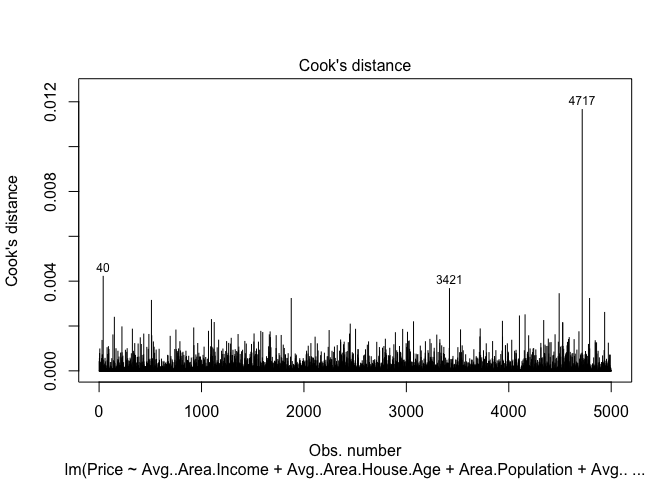<!-- -->  
Observing the cook’s distance plot above we can see no point lies above
0.5, hence we have no points to investigate whether they are influential
to our model. We have a perfect model!  
